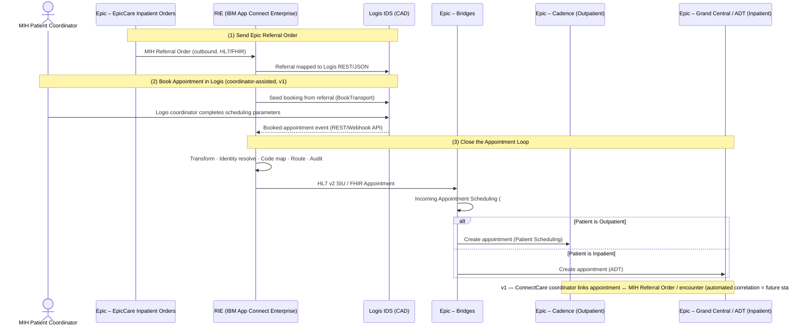

## 1. Executive Summary

Alberta Emergency Health Services (EHS) Community Paramedics — operating under the Mobile Integrated Health (MIH) program — document clinical encounters in Epic (Connect Care) but book and schedule visits in the Logis computer-aided dispatch (CAD) system. Logis was selected for scheduling because it provides real-time crew scheduling and participation in the broader EHS logistics network, capabilities Epic's native scheduling could not match for this use case. The consequence is that MIH appointments live only in Logis: they are invisible to the patient through Epic/MyChart, and clinicians must re-create an appointment in Epic purely to anchor the clinical documentation for the encounter. This creates duplicate effort and a visibility gap for patients.

This solution concept describes a set of system-to-system information exchanges that keep the appointment record synchronised between Logis and Epic without changing where each system performs its primary job — Logis remains the booking and dispatch system of record for MIH; Epic remains the clinical record. The key architectural finding is that **Logis does not publish a native HL7 or FHIR scheduling interface** for its CAD; its published integration model is an open REST/webhook API. Epic, by contrast, exposes a productised, standards-based inbound scheduling interface (HL7 v2 SIU / FHIR Appointment) through Bridges. The transformation between these two worlds must therefore be performed in the middle, by the **Regional Integration Engine (RIE) running on IBM App Connect Enterprise (ACE)**, which already sits in front of Epic Bridges in the HSS estate.

This document revises the original [[Epic to Logis Appointment Sync]] context model. It defines what must be built and identifies the new and existing components to add to the ArchiMate model.

---

## 2. Business Context

### 2.1 Current State

- MIH Community Paramedics use **Epic (Connect Care)** for clinical documentation and **Logis IDS** for appointment booking and real-time crew scheduling.
- An earlier attempt to use Epic's scheduling system was abandoned in favour of Logis so that MIH visits could participate in the larger EHS logistics network and real-time crew scheduling.
- Because Epic is not used for MIH scheduling, appointments do not surface to the patient (no MyChart visibility of when the community paramedic will arrive), and a clinician must manually create an Epic appointment to support documentation of the encounter.

### 2.2 Problem Statement

The split between the booking system (Logis) and the clinical system (Epic) produces two pain points:

1. **Duplicate effort** — an appointment is created twice (once in Logis to dispatch the crew, once in Epic to document the encounter).
2. **Reduced patient visibility** — the patient cannot see the scheduled MIH visit in Epic/MyChart because the authoritative appointment exists only in Logis.

### 2.3 Desired Outcome

Establish automated information exchanges so that an appointment booked in Logis is reflected as an actionable, chartable appointment in Epic, linked to the originating referral and encounter, with **minimal** manual re-keying — and so that the referral that triggers the MIH episode flows cleanly from Epic to Logis.

The patient-visibility benefit is deliberately scoped. Per the [[EHS MIH Appointment Scheduling Interface|29 June 2026 working session]], MyChart will surface the appointment **date only — not a time**. Automated patient notifications are turned **off**; the EHS coordination centre phones the patient with a time window derived from the Logis schedule. Closing the duplicate-effort gap — not full patient self-service scheduling visibility — is the primary v1 outcome.

---

## 3. Solution Overview and Key Decisions

### 3.1 Three Target Information Exchanges

The solution comprises three exchanges, matching the original note:

1. **Send Epic Referral Order** — an **accepted** MIH referral order (an ambulatory referral to MIH) raised in Epic is the trigger that pushes data to Logis to initiate the booking workflow.
2. **Book Appointment in Logis** — the referral seeds the booking, and a **Logis coordinator completes the scheduling parameters** that ConnectCare cannot supply. Logis remains the system of record for scheduling and dispatch. (See §3.5 — the 29 June session settled on coordinator-assisted booking for v1 rather than fully broker-driven automation.)
3. **Close the Appointment Loop** — Logis sends the booked-appointment notification back to Epic, where the appointment is created as an **Outpatient** or **Inpatient** appointment depending on patient location. In v1 a **ConnectCare coordinator links the two records** to close the loop; automated referral correlation is a future-state enhancement.

### 3.2 Standards Selection

| Concern | Decision | Rationale |
|---|---|---|
| Logis-side protocol | Logis open REST / webhook API | **Confirmed** by the [[Logis IDS TransferSchedulingBroker Interface]] specification: REST/JSON, HTTP Basic auth (Logis token as password), with Logis pushing status updates to a broker-hosted endpoint. No native HL7/FHIR scheduling interface. See the [[Logis TransferSchedulingBroker Interface Assessment]]. |
| Epic-side protocol | HL7 v2 **SIU** (or FHIR Appointment) via **Epic Bridges** | Epic's productised inbound scheduling interfaces consume SIU/FHIR. Bridges performs HL7v2 ↔ FHIR translation. |
| Epic inbound target interface | **Incoming Appointment Scheduling** (open.epic spec #5384) | Creates appointments that are *actionable* — check-in, cancel, and chartable from the clinical schedule. Required because the appointment must anchor clinical documentation. |
| (Rejected alternative) | Incoming External Appointments (spec #5371) | Records an external appointment for visibility/analytics only; it is **not** actionable or chartable, so it does not satisfy the documentation requirement. |
| CAD-to-CAD standard | **Not used for the appointment leg** | NENA EIDO / APCO CAD-to-CAD standards govern incident/dispatch data exchange between dispatch centres, not clinical appointment scheduling. Relevant to EHS dispatch interoperability generally, but not the correct standard for Epic appointment sync. |

### 3.3 Why the RIE Carries the Transformation

Because Logis emits a proprietary REST/JSON payload and Epic expects HL7 SIU/FHIR, a transformation layer is required. The **RIE on IBM ACE** is the natural home for this work because it already fronts Epic Bridges and because the integration involves more than protocol conversion:

- **Protocol/format transformation** — REST/JSON ↔ HL7 v2 SIU (or FHIR Appointment).
- **Identity resolution** — map Logis patient/provider/unit identifiers to Epic identifiers (PHN → Epic Patient ID, provider and department records). Can reuse Epic's Patient Lookup Web Service (spec #5454).
- **Terminology / code mapping** — Logis appointment types and statuses ↔ Epic visit types, departments, and scheduling statuses.
- **Routing** — direct the appointment to **Cadence** (outpatient) or **Grand Central / ADT** (inpatient) based on patient location.
- **Referral correlation** — link the returning appointment to the originating Epic referral order and encounter.
- **Audit logging** — record exchanges for Health Information Act (HIA) compliance.

### 3.4 Conceptual Flow

### 3.5 Realisation via the TransferSchedulingBroker Interface

The [[Logis IDS TransferSchedulingBroker Interface]] specification confirms how this flow is realised on the Logis side, and the **RIE plays the "TransferSchedulingBroker" role** the vendor expects as its integration counterpart. Three points shape the design:

- **Booking model — coordinator-assisted for v1 (decided), broker-driven deferred.** The interface *supports* the broker initiating the booking into Logis via `BookTransport` (`POST …/transferschedulingbroker/transport`), with Logis acting as the dispatch/execution engine returning status. The **29 June 2026 working session** settled the open design decision: v1 will be **coordinator-assisted** — the Epic referral seeds the booking, a Logis coordinator completes the parameters ConnectCare cannot send, and a ConnectCare coordinator links the returned appointment. Fully broker-driven automation (`BookTransport` with no human completion, plus automated referral correlation) remains the **target future state** because it removes the residual double-handling, but it is **not** the v1 scope. This changes the realisation *pattern* but not the *components*: the RIE still seeds the referral and mediates the round trip.
- **OnHold → Confirm handshake.** A new booking is held **OnHold** in Logis until the RIE sends `ConfirmTransport` (Accept/Reject). On Accept, the OnHold reason is cleared and the transport is planned; on Reject it is cancelled. The RIE must implement this extra handshake stage; it has no equivalent in the original narrative.
- **Transport-vs-appointment semantics.** The interface models a *transport* (`ALocation`→`BLocation`, pickup/dropoff, driving statuses, ETA), with an `IsAppointment` flag. MIH encounters are home visits rather than A→B transports, so SMEs must confirm the mapping (likely crew base → patient location) and whether the separate **Logis IDS Appointments module** is a better fit than the transport broker (see §6, §7).

---

## 4. ArchiMate Model Updates

This section revises the original context model. Elements are grouped into those that **already exist** in the model or estate and are reused, and those that are **new** and must be added.

### 4.1 Existing Components (Reused)

| Element | ArchiMate Type | Notes |
|---|---|---|
| MIH Patient Coordinators | Business Role / Actor | Existing swimlane; performs booking. |
| HMIH Triage Intake | Business Process | Existing; raises the referral. |
| Schedule MIH Appointment | Business Process | Existing; booking in Logis. |
| MIH Referral Order | Business Object / Data Object | Existing; originates in Epic. |
| Epic – EpicCare Inpatient Orders | Application Component | Existing; holds the referral order and the encounter to link to. |
| Logis IDS PRD | Application Component | Existing; system of record for MIH scheduling and dispatch. |
| MIH Appointment (Booked) | Data Object | Existing; the booked appointment in Logis. |
| Epic – Bridges | Application Component | Existing interface engine; HL7v2 ↔ FHIR translation. |
| Epic – Cadence (Patient Scheduling) | Application Component | Existing; outpatient appointment target. |
| Epic – Grand Central (ADT) | Application Component | Existing; inpatient appointment target. |

### 4.2 New Components (To Add and Build)

| Element | ArchiMate Type | Description |
|---|---|---|
| Regional Integration Engine (RIE) | Application Component | The transformation and orchestration hub, which **realises the "TransferSchedulingBroker" role** that the Logis interface expects as its integration counterpart. **New to this model** (exists in the estate but must be added to the diagram and configured for this flow). |
| Booking Correlation Store | Data Object | RIE-owned cross-reference of `BookingId` ↔ Epic patient / referral order / encounter. Load-bearing because the Logis payload carries **no PHN/MRN** — the broker-assigned `BookingId` is the only join key (see §6). |
| IBM App Connect Enterprise (ACE) | Technology Node / System Software | Technology that realises the RIE Application Component. |
| Appointment Transformation Service | Application Service / Application Function | REST/JSON ↔ HL7 v2 SIU / FHIR Appointment transformation, hosted on the RIE. |
| Identity Resolution Service | Application Service / Application Function | Resolves Logis identifiers to Epic identifiers; may invoke Epic Patient Lookup Web Service (#5454). |
| Terminology / Code Mapping Service | Application Service / Application Function | Maps Logis appointment types/statuses to Epic visit types/departments/statuses. |
| Appointment Routing Service | Application Service / Application Function | Routes to Cadence (outpatient) or Grand Central/ADT (inpatient) by patient location. |
| Referral Correlation Service | Application Service / Application Function | Links the returning appointment to the originating Epic referral and encounter. |
| Integration Audit Log | Data Object | HIA-compliant record of each exchange. |
| Identity & Terminology Cross-Reference | Data Object | Mapping tables consumed by the RIE services. |

### 4.3 New Interfaces (To Add and Build)

| Interface | ArchiMate Type | Provider → Consumer | Format |
|---|---|---|---|
| Epic Outbound Referral Interface | Application Interface | Epic (EpicCare Orders / Bridges) → RIE → Logis | HL7/FHIR out of Epic; REST into Logis (mapped by RIE) |
| Logis Booking API (`BookTransport` / `ConfirmTransport` / `CancelTransport` / `AttachFileToTransport`) | Application Interface | RIE (as TransferSchedulingBroker) → Logis IDS | Logis REST/JSON, HTTP Basic auth. `BookTransport` POST/PUT, `ConfirmTransport`, `CancelTransport` (DELETE), `AttachFileToTransport`. |
| Logis Transport Status Callback (`TransportStatusUpdate`) | Application Interface | Logis IDS → RIE (as TransferSchedulingBroker) | Logis pushes status (`NotStarted`…`Finished`/`Cancelled`, plus ETA-change events) to a broker-hosted endpoint; RIE acknowledges with `TransportStatusResponse`. |
| Epic Incoming Appointment Scheduling | Application Interface | RIE → Epic Bridges | HL7 v2 SIU (or FHIR Appointment), spec #5384 |
| Epic Patient Lookup Web Service | Application Interface | RIE → Epic | Spec #5454 (reused for identity resolution) |

> Note: the original model contained placeholder elements **"Logis Outbound Epic Appointment Interface"** and **"MIH Logic Appointment Information"** and an **"Appointment Information Exchange"** flow. These are retained but re-cast: the outbound Logis interface now terminates at the **RIE**, not directly at Bridges, and "Appointment Information Exchange" becomes the RIE-mediated transformation rather than a point-to-point link.

### 4.4 Relationships / Flows to Add

1. **Flow:** Epic – EpicCare Inpatient Orders → RIE (Epic Outbound Referral Interface) — *Send Referral*.
2. **Flow:** RIE → Logis IDS PRD (Logis Inbound Referral API) — *referral lands in Logis*.
3. **Serving:** Logis IDS PRD → RIE (Logis Outbound Appointment Interface) — *booked appointment event*.
4. **Realisation:** IBM ACE (Technology) realises RIE (Application).
5. **Composition:** RIE composed of Transformation, Identity Resolution, Code Mapping, Routing, and Referral Correlation services.
6. **Access:** RIE services access Identity & Terminology Cross-Reference and write Integration Audit Log.
7. **Flow:** RIE → Epic Bridges (Incoming Appointment Scheduling #5384).
8. **Flow (routing branch):** Bridges → Cadence (Outpatient) and Bridges → Grand Central/ADT (Inpatient).
9. **Association:** created Epic appointment ↔ MIH Referral Order / encounter (referral correlation).

---

## 5. What Needs to Be Built

| # | Build Item | Owner (proposed) | Dependency |
|---|---|---|---|
| 1 | Epic outbound referral interface (referral order → RIE) | HSS / Epic | Confirm Epic outbound order/referral message and Logis inbound capability |
| 2 | Logis inbound referral API consumption | Logis/ESO + HSS | Logis API spec |
| 3 | Logis outbound appointment interface (book/reschedule/cancel/no-show events) | Logis/ESO + HSS | Logis IDS Appointment API spec; webhook vs polling |
| 4 | RIE transformation flows on IBM ACE (REST/JSON ↔ HL7 SIU/FHIR) | HSS Integration | Logis payload schema; Epic #5384 spec |
| 5 | Identity resolution (Logis IDs → Epic Patient/provider/department) | HSS Integration | Epic Patient Lookup #5454; provider/department reference data |
| 6 | Terminology / code mapping configuration | HSS Integration + MIH SMEs | Logis appointment type/status catalogue; Epic visit type/department build |
| 7 | Outpatient/inpatient routing logic | HSS Integration | Patient-location data element from Logis or Epic |
| 8 | Epic Incoming Appointment Scheduling (#5384) build in Bridges → Cadence / Grand Central | HSS / Epic | Epic build of MIH visit types and a **single department-level resource** (no vehicle/truck resources) |
| 9 | Referral-to-appointment linkage / loop closure — **v1: manual link by ConnectCare coordinator**; automated Referral Correlation Service = future state | HSS / Epic | Referral identifier carried end-to-end; Booking Correlation Store |
| 10 | Audit logging for HIA compliance | HSS Integration | HIA audit requirements |

---

## 6. Risks and Considerations

- **Vendor interface uncertainty.** The single largest unknown is exactly what the Logis IDS Appointment interface emits. The published evidence shows an open REST/webhook API, not a native HL7/FHIR scheduling feed; this must be confirmed before effort is sized (see §7).
- **Actionable vs. external appointment.** Using Incoming External Appointments (#5371) would be simpler but yields a non-chartable record, defeating the documentation goal. The actionable Incoming Appointment Scheduling (#5384) is required, which carries more build and matching rigour.
- **Identity matching quality.** Loop closure depends on reliable patient (and provider/department) identity mapping; poor matching produces orphaned appointments. Reusing Epic's Patient Lookup service mitigates this.
- **Patient-location signal for routing.** The outpatient/inpatient decision needs a trustworthy patient-location data element; confirm whether Logis or Epic is the authoritative source at the time of booking.
- **Bidirectional consistency.** Reschedules, cancellations and no-shows must propagate in both directions to avoid the two systems drifting apart. Note the interface constrains this: a reschedule is a `PUT` permitted **only until `DrivingToPickup`** (later changes require cancel-and-rebook), and **no-show has no native status** so it must be synthesised (likely a `Cancelled` with a designated reason code).
- **No patient identifier in the Logis payload.** The interface `Patient` type carries name, DOB, gender, address, phones and physicians but **no PHN/MRN**; bookings are keyed only by the broker-assigned `BookingId`. The RIE must therefore own the `BookingId` ↔ Epic patient/referral/encounter correlation (the Booking Correlation Store). The 29 June session reinforced the mitigation: **PHN must be carried outbound from Epic, where confidence is high**, and a PHN *lookup* in Logis must be avoided — the ePCR project established a painful precedent for unreliable Logis-side patient matching. Because the referral originates in Epic and the RIE holds the correlation, the design should never need to resolve a PHN from Logis demographics; Epic Patient Lookup (#5454) becomes a fallback rather than the primary path.
- **Booking model decided (v1) — but completion stays manual.** The 29 June session settled the workflow-inversion question: v1 is **coordinator-assisted**, not fully broker-driven (see §3.5). The trade-off is that residual manual effort remains — a Logis coordinator completes scheduling parameters and a ConnectCare coordinator links the returned record — so the duplicate-effort problem is *reduced*, not eliminated, until the broker-driven future state is built. The automated **Referral Correlation Service** is therefore a future-state component, not a v1 build item.
- **Appointment-status freeze and resourcing.** Check-in/check-out is driven entirely by Logis. An appointment can still move in Epic until the Logis status reaches **`arrived`** (the operational freeze point the program described; reconcile against the interface's reschedule-until-`DrivingToPickup` constraint during the George session). Logis checks appointments in the day ahead and its SLAs can lock them down; the paramedic logs into Logis, picks up the appointment and self-associates, so **no vehicle-level resource is needed in Epic**. Epic uses a **single department-level resource** rather than individual trucks — vehicles were built into Epic for launches 4 and 6, then removed, and the program agreed not to rebuild them. This simplifies the Epic visit-type/department build and the identity-resolution scope.

---

## 7. Open Questions / Vendor Dependencies

To be confirmed with Logis/ESO and the Epic teams before sizing:

1. ~~Does the Logis IDS Appointments module / IDS API support **outbound HL7 v2 SIU or FHIR Appointment natively**, or only the proprietary REST/webhook API?~~ **Answered** by the [[Logis IDS TransferSchedulingBroker Interface]]: REST/JSON only, no native HL7/FHIR. *Residual:* confirm whether the separate **Logis IDS Appointments module** differs from this transport broker and is the better fit for home-visit semantics (see §3.5).
2. Could the existing **ESO Health Data Exchange (HDE)** pathway (which already does bidirectional EMS↔EHR exchange with Epic) carry appointment events, or is HDE scoped to ePCR/outcomes only?
3. ~~The **IDS Appointments API specification** (already being requested): confirm payload, event triggers (book / reschedule / cancel / no-show), and webhook vs. polling delivery.~~ **Answered**: payload and operations are defined (`BookTransport`/`ConfirmTransport`/`CancelTransport`/`AttachFileToTransport` + inbound `TransportStatusUpdate`); delivery is **push/webhook** (Logis → broker endpoint). *Residual:* no-show is not a native status and must be mapped; reschedule (`PUT`) is allowed only until `DrivingToPickup`.
4. On the Epic side, confirm **Incoming Appointment Scheduling (#5384)** as the inbound target and the MIH visit-type/department build required in Cadence and Grand Central.
5. ~~Confirm the **MIH workflow model** — broker-driven booking (RIE calls `BookTransport`) vs. coordinator-manual booking.~~ **Decided (29 June 2026):** v1 is **coordinator-assisted** (Epic referral seeds the booking; Logis coordinator completes parameters; ConnectCare coordinator links the returned record). Fully broker-driven automation is deferred to a future state (see §3.5, §6). *Residual:* confirm the resulting MIH Patient Coordinator / Logis coordinator role split in the end-to-end workflow model.
6. **Epic outbound message type — orders interface vs. referral notification.** Confirm with George (week of 6 July) whether the Epic→Logis trigger is an **outgoing orders interface** or a **referral notification**, and whether the inbound-to-Logis message is **HL7 v2 SIU** (likely — no FHIR API exists to create appointments in Logis) or FHIR. This determines the RIE transformation build and the Epic-side configuration. Define the **minimum spec** for what data travels in each direction.

---

## Appendix A: Acronyms and Abbreviations

| Term | Definition |
|---|---|
| ACE | IBM App Connect Enterprise (integration runtime) |
| ADT | Admit / Discharge / Transfer |
| CAD | Computer-Aided Dispatch |
| EHS | Emergency Health Services |
| FHIR | Fast Healthcare Interoperability Resources |
| HDE | (ESO) Health Data Exchange |
| HIA | Health Information Act (Alberta) |
| HL7 | Health Level Seven |
| IDS | (Logis) Intelligent Dispatch System |
| MIH | Mobile Integrated Health |
| RIE | Regional Integration Engine |
| SIU | Scheduling Information Unsolicited (HL7 v2 message type) |

---

## Appendix B: Sources and References

- Logis IDS product page (open APIs, third-party integrator): https://logissolutions.net/solutions/logis-ids/
- Logis Solutions interoperability (open APIs, ready-to-deploy integrations): https://logissolutions.net/resources/interoperability/
- Logis IDS Appointments module: https://logissolutions.net/enhancing-patient-engagement-scheduling-and-pre-arrival-information-for-improved-care/
- Logis Dispatch by ESO (MIH workflows): https://www.eso.com/logis-dispatch-by-eso/
- ESO Health Data Exchange (bidirectional EHR integration; Epic/Cerner/Allscripts): https://www.eso.com/hospital/health-data-exchange/
- open.epic — Scheduling HL7v2 interfaces (specs #5384, #5371, #5296, #5322): https://open.epic.com/Scheduling/HL7v2
- NENA EIDO / CAD-to-CAD interoperability status (National 911 Program): https://www.911.gov/assets/NHTSA_CAD_Current_Status_of_CAD_Interoperability_Final_29July2022.pdf
- AHS I/Request (Logis) user guide: https://www.albertahealthservices.ca/assets/info/ems/if-ems-irequest-user-guide.pdf

---

## Appendix C: Document History

| Date | Author | Change |
|---|---|---|
| 2026-06-15 | Alec Blair (with Claude) | Initial revised solution concept model, derived from the Epic to Logis Appointment Sync context note. |
| 2026-06-23 | Alec Blair (with Claude) | Added OKF frontmatter. Revised to reflect the Logis TransferSchedulingBroker interface specification: confirmed REST/JSON + push delivery (closed open questions #1, #3), recast RIE as the TransferSchedulingBroker role, relabelled Logis interfaces to actual operations, added the broker-driven workflow and OnHold→Confirm handshake (§3.5), and added the patient-identifier gap, workflow-inversion decision, and Booking Correlation Store. |
| 2026-06-24 | Alec Blair (with Claude) | Converted the §3.4 Conceptual Flow from an ASCII diagram to a Mermaid sequence diagram. |
| 2026-06-29 | Alec Blair (with Claude) | Revised to reflect the [[EHS MIH Appointment Scheduling Interface\|29 June MIH Appointment Scheduling working session]]: settled the booking model as **coordinator-assisted for v1** (broker-driven automation deferred), recast automated referral correlation as future state, narrowed the patient-visibility outcome (MyChart date-only, automated notifications off, coordination centre calls), added the appointment-status freeze (`arrived`) and single department-level resource (no vehicles) decisions, reinforced PHN-from-Epic (avoid Logis lookup, ePCR precedent), and added open question #6 (Epic outbound orders-vs-referral-notification message type, HL7 v2 vs FHIR — to confirm with George, week of 6 July). |

---

_Related:_ [[Epic to Logis Appointment Sync]] · [[EHS MIH Appointment Scheduling Interface|29 June 2026 Working Session]] · [[Logis TransferSchedulingBroker Interface Assessment]] · [[Logis IDS TransferSchedulingBroker Interface]] · [[CLAUDE-HSS]]
