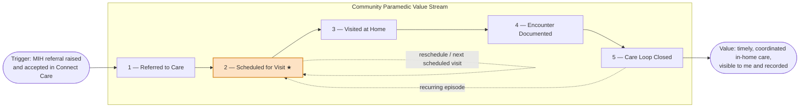

> **Status: Proposed / first draft for review.** This is an early-stage value-stream proposal built with the value-stream method used in the Stealth EA methodology (stakeholder-first, value per stage, exit criteria per stage). It is intentionally a tabular + Mermaid draft; the formal ArchiMate Motivation View and Capability View would be built in Archi once the stages and their value are confirmed. See [[Epic to Logis Appointment Sync Solution Concept Model]] and the [[EHS MIH Appointment Scheduling Interface|29 June 2026 working session]].

## 1. Why Start Here

We are deciding whether to model the end-to-end Epic ↔ Logis workflow now, or to first frame it inside the value stream it serves. Modelling the value stream first is the better sequence: it confirms the patient value at each stage, shows that the appointment-sync problem lives in **one** stage, and lets us drill into that stage's workflow only because it is genuinely complex — which is exactly the condition under which detailed workflow / business-capability-instance modelling is warranted. The value stream becomes the frame for the SBAR; the Solution Concept Model becomes the realisation of a single stage.

## 2. Stakeholder, Trigger, and Overall Value

**Stakeholder receiving the value:** the **community-dwelling patient** (MIH client) who needs scheduled, in-home community-paramedic care. The value stream is written from this patient's perspective, not the programme's.

**Trigger:** an **MIH referral order is raised and accepted in Connect Care (Epic)** — typically by a referring clinician (ED, primary care, or a hospital discharge pathway) acting as a proxy for the patient. This is an *indirect* trigger: the patient does not self-initiate, so the stream is part of a wider **value stream network** (a referring value stream hands off into this one). Patient consent is captured within the first stage.

**Overall value to the patient:** *timely, coordinated community-paramedic care delivered in my home, visible to me, and recorded in my health record* — reducing avoidable ED visits and hospital reliance while keeping my care team informed.

## 3. Proposed Value Stages

A value stage exists only where there is a measurable increment of value **to the patient**. Five stages are proposed (within the 4–7 guideline):

★ Stage 2 is the integration-heavy stage where the [[Epic to Logis Appointment Sync Solution Concept Model]] lives. The dotted loops show that reschedules and recurring visits re-enter at Stage 2 — a normal value-stream-network behaviour for an ongoing care episode.

| # | Stage | Value to the patient (value element) | Exit criteria (stage is "done" when…) | Key business capabilities | Primary roles |
|---|---|---|---|---|---|
| 1 | **Referred to Care** | "My need for in-home care has been recognised and accepted — I will be looked after." | Referral is triaged and **accepted** into the MIH programme; patient eligibility and consent confirmed. | Referral Management · Intake & Triage · Eligibility & Consent | Referring clinician · MIH Triage / Intake |
| 2 | **Scheduled for Visit** ★ | "A community-paramedic visit is booked for me, and I can see the date." | Appointment **booked in Logis** and reflected as a chartable appointment in Epic; date visible in MyChart; coordination centre has the time window to confirm with the patient. | Appointment Scheduling · Crew / Resource Scheduling & Dispatch Planning · **Cross-system Appointment Synchronisation** · Patient Notification | MIH Patient Coordinator (Connect Care) · Logis Coordinator · Coordination Centre |
| 3 | **Visited at Home** | "A paramedic came to me and I received care where I live." | Crew dispatched and **arrived** (Logis status = `arrived`); assessment and treatment delivered at the point of care. | Crew Dispatch & En-route Management · Mobile Clinical Care · Clinical Assessment · Point-of-care Treatment | Community Paramedic · Patient |
| 4 | **Encounter Documented** | "My care is recorded so my care team knows what happened to me." | Encounter documented in Epic against the originating referral / appointment; visit **checked out / completed** in Logis (status = `finished`). | Clinical Documentation · Encounter Management · Record Linkage | Community Paramedic · Clinician |
| 5 | **Care Loop Closed** | "My next steps are handled — a follow-up is booked, my referral is closed, or I'm escalated appropriately." | Referral outcome/disposition recorded; follow-up scheduled (re-enters Stage 2) **or** episode closed; outcomes available to the referrer and to the patient in MyChart. | Outcome & Disposition Management · Follow-up Scheduling · Results Distribution · Care Coordination | MIH Coordinator · Referring clinician |

## 4. Candidate Measures (to align in the Motivation View)

Per the method, value can also align to a strategic goal or a Balanced Scorecard measure. Candidate stage-level measures to confirm with the programme:

- **Stage 1 — Referred to Care:** referral acceptance rate; time from referral to acceptance.
- **Stage 2 — Scheduled for Visit:** time from accepted referral to booked appointment; appointment-sync error / orphaned-appointment rate; % appointments visible in MyChart. *(This is the stage the current initiative most directly improves.)*
- **Stage 3 — Visited at Home:** time from booking to visit; on-time arrival rate within the communicated window; visits completed as scheduled.
- **Stage 4 — Encounter Documented:** documentation completeness; time from visit to documented encounter; duplicate-entry effort eliminated.
- **Stage 5 — Care Loop Closed:** follow-up scheduling rate; ED / hospital re-presentation avoided within N days; referrer notified rate.

## 5. Where Workflow Modelling Belongs

Stages 1, 3, 4 and 5 are relatively linear and can stay at the capability level for now. **Stage 2 — Scheduled for Visit — is the complex one**: it spans two systems (Epic and Logis), the RIE transformation, two coordinator roles, and the OnHold/confirm and status-callback lifecycle. That complexity is the justification for drilling into it with a **role-based workflow / business-capability-instance view** — the same pattern as the Stealth EA worked examples (value stream → pick the complex stage → business-capability-instance model → role-based workflow).

**Recommended sequence:**

1. Confirm this value stream — stakeholder, stages, value, and exit criteria — with the programme.
2. Build the ArchiMate **Motivation View** (value per stage) in Archi to lock the value articulation.
3. Build the **Capability View** for Stage 2 only.
4. Drill Stage 2 into the **role-based workflow** (business-capability-instance view), which is where the [[Epic to Logis Appointment Sync Solution Concept Model]] system-interaction sequence becomes the technical realisation.

On notation: the Motivation and Capability views are best done in **Archi/ArchiMate** (they carry the value, capability and traceability semantics, and live alongside the rest of the HSS model). The system-interaction sequence stays as **Mermaid** in the Solution Concept Model. This strip and the table above are the early-stage draft that precedes the Archi work.

## 6. Open Points for Confirmation

- Stage boundaries and the **value statement** for each stage (especially whether "Care Loop Closed" is one stage or splits into *documented outcome* vs *follow-up*).
- Whether **consent** warrants visibility as its own early value increment.
- The **trigger set** — is an accepted referral the only trigger, or are there self-referral / re-referral paths that change Stage 1?
- Which measures the programme already tracks, so the Motivation View aligns to existing goals rather than inventing new ones.

---

_Related:_ [[Epic to Logis Appointment Sync Solution Concept Model]] · [[Epic to Logis Appointment Sync]] · [[EHS MIH Appointment Scheduling Interface|29 June 2026 Working Session]] · [[CLAUDE-EHS]]
