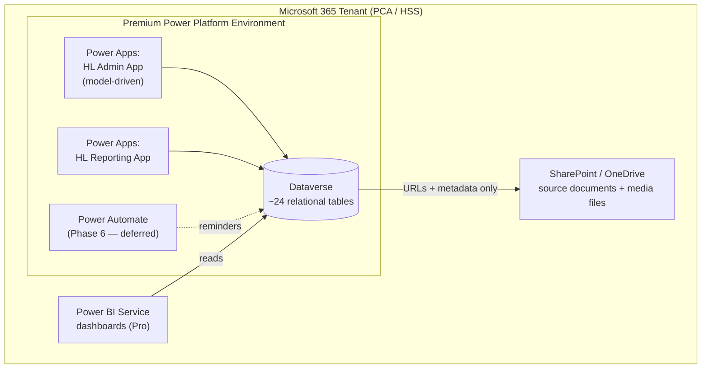

# Honouring Life — Initial Assessment & Preliminary Analysis

> **Purpose**: An enterprise architecture orientation to the Microsoft Power Platform paired with a first-pass architectural read on the Honouring Life Grant (HLG) program's proposed solution. Written before platform access is granted, so the Power Platform sections double as a primer. Sources reviewed: `HL_ITRequest_PowerPlatform_v5.docx`, `HL_Schema_Reference_v1.4.docx`, `HL Brief Architecture Summary.docx`, `HL Data Model ERD.pdf`.

---

## 1. The request in one paragraph

The Honouring Life team within the Indigenous Wellness Core wants to retire a single Excel workbook that tracks 40+ multi-year grant contracts and replace it with a relational solution built on Microsoft 365 tooling already in the tenant: **Dataverse** for storage (~24 tables), **Power Apps** for two data-entry applications (~22–24 form screens), and **Power BI** for dashboards, with **Power Automate** notifications deferred to a later phase. The request to IT is narrow and sensible: confirm a premium Power Platform environment, confirm premium licensing for 4–6 users, and confirm the governance/privacy pathway. The build is staged across six phases over roughly fourteen weeks. The submitter is Kristin Flemons (Research Associate); the manager is Marjorie Luzentales-Simpson.

---

## 2. Power Platform orientation (what the moving parts actually are)

Power Platform is Microsoft's low-code suite that sits on top of the Microsoft 365 tenant. Four components are relevant here:

**Dataverse** is the managed relational data platform — think of it as a hosted database with relationships, a security model, and business logic baked in, rather than a set of flat lists. It enforces referential integrity at the platform level, supports one-to-many (lookup) and many-to-many (N:N) relationships, and lets you define choice lists, cascade-delete behaviour, and field-level validation through configuration rather than code. This is the heart of the proposal and the reason premium licensing is triggered.

There are two tiers worth distinguishing. **Dataverse for Teams** is the free, cut-down version scoped to a single Microsoft Team — roughly 2 GB / ~1 million rows, with a thinner security model and no support for the richer relational and governance features. **Full Dataverse** (what the team is asking for) runs in a dedicated Power Platform *environment* and unlocks security roles, the full relationship model, and proper application lifecycle management. The team is correct that Dataverse for Teams is not suitable here — the schema is genuinely relational and needs the security and integrity features only full Dataverse provides.

**Power Apps** is the application layer over Dataverse. It comes in two flavours. *Model-driven apps* are generated automatically from the Dataverse schema — forms, views, navigation, and sub-grids are configured, and conditional logic is handled by "business rules" rather than written code. *Canvas apps* give pixel-level control over the interface and use a formula language called Power Fx; they are more flexible but more hand-built and higher-maintenance. The distinction matters for this assessment (see §4).

**Power BI** is the reporting and dashboard layer. *Power BI Desktop* is free and used to author reports; *Power BI Service* (the cloud workspace, requiring a *Pro* licence) is what lets you publish, share, and schedule refreshes. Dashboards read from Dataverse through a native connector.

**Power Automate** is the workflow/automation engine — scheduled or triggered flows such as "send a reminder when a report is due." The team has correctly deferred this to Phase 6.

**Licensing in plain terms.** Premium licensing is triggered the moment you use Dataverse or a premium connector (the Dataverse connector is itself premium). So the 4–6 users each need a **Power Apps Premium** licence (USD ~$20/user/month list) to use the apps, and anyone sharing/refreshing dashboards needs **Power BI Pro** (USD ~$14/user/month list). These are list prices in USD; PCA/AHS almost certainly licenses through an enterprise agreement, so the real question is entitlement under the existing M365 agreement, not retail cost. At 4–6 users this is a small spend — the gating constraints are environment provisioning and governance, not dollars.

---

## 3. What the team has actually designed

The schema (v1.4) is materially more mature than "we want to move off a spreadsheet." It defines **24 tables** — 20 administrative, 1 shared, 3 reporting — with a documented relationship map, cascade behaviours, and ten reusable Global Option Sets. The reporting grain is well chosen: `HL_Activity_Instance` is one row per delivered activity, tied to Contract + Activity Family + Fiscal Year, which is the right fact-table shape for the Power BI layer.

A few design choices signal a competent data modeller:

- **History without overwriting.** `Community_Demographics`, `Community_Contacts`, and `Community_Compliance` preserve history by adding rows and using `Is_Current` / effective-date fields rather than editing in place.
- **An audit/lifecycle spine.** `Admin_Events` records every contract and community lifecycle change (extension, amendment, hold, name change, etc.), and the design mandates that status, value, and end-date changes flow through a single Power Apps form that updates *both* the event row and the parent record in one submission. That is a thoughtful integrity pattern.
- **Deliberate de-normalization restraint.** Community is intentionally inferred through the Contract relationship on activity instances rather than duplicated, to avoid a redundant FK with no enforcement.
- **Right tool for tagging.** A shared `Attribute_Registry` plus native Dataverse N:N relationships replaced three explicit junction tables in v1.4 — the correct move, with one junction (`Contract_Outcome_Links`) deliberately retained because its link carries a `Notes` field.
- **Files stay in SharePoint.** Dataverse stores URLs and metadata for documents and media; the binaries remain in SharePoint/OneDrive. Sound separation.

The migration rationale is also sound and explicitly documented: the N:N tagging tables were projected to exceed SharePoint/Power Apps' ~2,000-row delegation ceiling within the first year, Dataverse enforces referential integrity centrally, and model-driven apps reduce form-building effort. This is exactly the reasoning that justifies Dataverse over SharePoint Lists.

---

## 4. Architectural read — is this design sound?

**Short answer: yes, the platform choice and data model are well-judged for the problem.** This is a legitimate relational application, not a list that's been over-engineered. Dataverse is the appropriate backend, the schema is normalised sensibly, and the team has already resolved most of the hard modelling questions. For a citizen-developer effort it is unusually disciplined.

That said, there are points an EA review should raise — none fatal, all worth confirming before the Phase 2 build begins.

### 4.1 The privacy claim is understated — this is the most important finding

The IT request states the solution involves "no PHI or PII beyond organizational names and staff names." That is not quite accurate. The schema clearly holds **personal information**:

- `Community_Contacts` stores contact **names, emails, and phone numbers** of individuals.
- `Staff` stores names and emails.
- `HL_Media_Sets` links to **photos and video of community activities** — with `Consent_Verified` and `Approved_For_External_Use` flags that exist precisely because identifiable individuals (potentially including youth, given the program's life-promotion focus) appear in them.
- `HL_Qual` holds qualitative excerpts from community reports.

None of this is *health* information, so the team's "no PHI" framing is defensible, but it is personal information subject to Alberta's FOIP Act, and the request's own §4 hedges by asking IT to confirm whether a privacy/InfoCare review is required. **Recommendation: treat a privacy assessment as required, not optional**, and scope it to cover contact PII and consent-managed media.

Beyond FOIP, this is data *about Indigenous communities* held by a provincial body. **Indigenous data governance / data sovereignty (OCAP® — Ownership, Control, Access, Possession)** is a live consideration that a generic IT privacy review may not surface on its own. Worth raising deliberately given the program sits in the Indigenous Wellness Core.

### 4.2 Environment and DLP are the real gating items

The request asks IT to confirm a premium environment. The substantive questions behind that are: does PCA/HSS already operate an approved premium Power Platform environment this can land in, and do existing **Data Loss Prevention (DLP) policies** classify the Dataverse connector in a way that would block it? In many AHS/HSS tenants, citizen-developer environments and connector use are governed centrally; the build cannot start until that is settled. This is a governance dependency, not a licensing one.

### 4.3 Support model and ALM — key-person and inheritance risk

The request states ongoing support stays with the "maker/program team" per the AHS Maker Playbook. That is the standard citizen-developer posture, but it carries **key-person risk** (much of this rests on one Research Associate) and there's no mention of **application lifecycle management** — separate development/test/production environments and a managed solution. For a system that will become the authoritative record for 40+ multi-year contracts and the financial holdback logic, this is the central governance condition on the request: the exit/retirement plan it implies is set out in §5.

### 4.4 Canvas vs model-driven not yet settled

The schema's Appendix A gives design notes for *both* model-driven and canvas apps (e.g., `Relate()`/`Unrelate()` guidance is canvas-specific, while business-rules and sub-grid guidance is model-driven). For a relational, form-and-grid-heavy admin tool like this, **model-driven is the better fit** — it auto-generates most of the UI, enforces the relationships, and is far cheaper to maintain than a hand-built canvas app. Worth confirming the team intends model-driven for the Admin App; the single-submission `Admin_Events` requirement is more naturally met with a model-driven form plus a small amount of logic.

### 4.5 Financial data and report-level security

The financial tables (`Contract_Financial`, holdback logic, disbursement amounts) are flagged Internal–Sensitive and the design relies on Dataverse security roles and app-level access — appropriate. One thing to confirm for the reporting layer: whether **Power BI row-level security** or workspace segregation is needed so that dashboard viewers don't see financial detail beyond their remit. The request already commits to organizational-only (non-public) workspaces, which is the right baseline.

### 4.6 Minor / lower-risk observations

Legacy data migration is deferred but the schema is designed to accept it later — fine. The ERD and schema show a handful of cosmetic inconsistencies (e.g., `Coverage_Periof`, `Recieved`/`Ammount`/`Holback` spellings in the ERD/PDF, and an `Attendee_Name` field typed inconsistently between schema and ERD) — trivial, but worth cleaning up before the build so the Dataverse column names don't inherit typos. Several "Confirm with team / admin before Phase 2" items remain open in the schema's §7 (disbursement structures in use, critical-events scope, CoP attendance scope) — these are normal pre-build confirmations, not architectural gaps.

---

## 5. Exit and retirement plan (the real governance ask)

The point of §4.3 is not "is this well built" — it is *what happens when the maker leaves and no one picks it up.* The objective is to engineer the situation so the only realistic outcomes are **transfer** or **clean decommission** — never "IT inherits an orphaned production app it didn't build and can't readily support." Two things make that true: a governance agreement that IT does not inherit maker-built solutions, and technical choices that keep the system portable and its data recoverable.

One observation worth stating plainly: the quality of these artifacts — a normalised 24-table ERD with cascade rules and N:N modelling — is well beyond what most program staff, and many IT professionals, produce by hand, which strongly suggests LLM-assisted design. That is not a criticism; the output is sound. But it raises the stakes on handover, because a sophisticated design its owner did not derive themselves is harder for that owner to explain and harder still for a successor to inherit. As-built documentation, and an owner who genuinely understands the system, matter more here than usual.

### 5.1 Set the no-inheritance agreement at intake

Get it in writing *now*, before build, that this is a program-owned solution under the AHS Maker Playbook and that IT does not assume support or ownership if the maker departs, with the **business owner (the manager) accepting accountability** for either continuity or decommission. This is far easier to agree before the app exists than after it has quietly become mission-critical.

### 5.2 Build it to be inheritable (so transfer is even possible)

- **Service-account ownership, not personal.** Apps, flows, and data connections must be owned by a shared/service account — not the maker's personal account — or deprovisioning her account silently breaks the apps and scheduled refreshes. This is the most common citizen-developer failure mode and the cheapest to prevent.
- **Managed solution + ALM.** Package everything in a managed Power Platform solution rather than building loose in the default environment, so the whole thing is portable and transferable; a dev→prod path beats editing production directly.
- **Co-owner / second maker.** Name at least one additional person on the program side with maker access and basic literacy. A bus factor of one is the core risk; a bus factor of two changes the conversation.
- **Keep documentation as-built.** The schema reference (v1.4) is genuinely good — mandate it stays current through the build, plus a short maker's guide on how forms, business rules, and any flows are wired.

### 5.3 Decision path when the maker leaves

1. **Transfer** — a second program maker adopts it. Feasible only if 5.2 is in place.
2. **Freeze** — set to read-only: data stays accessible for reporting and retention, new entry stops, no maintenance burden.
3. **Decommission** — export and retire. This must be the documented default if no one picks it up.

The reassuring part is that **Dataverse data exports cleanly** (to CSV/Excel or back to SharePoint), and source documents and media already live in SharePoint — so the authoritative grant, contract, and financial records are recoverable independent of the app. The retirement plan should specify the export format and destination, compliance with the applicable **records-retention schedule** (these are financial and contract records under FOIP/Alberta retention rules — they cannot simply be deleted), and how reporting continuity is maintained after shutdown.

### 5.4 Keep it honest with a light annual gate

A once-a-year checkpoint — maker still in seat? documentation current? ownership still on service accounts? — catches drift before it becomes a crisis. Cheap insurance.

---

## 6. Bottom line and suggested next steps

The Honouring Life team has done good work. The decision to move from Excel → (briefly) SharePoint Lists → Dataverse is correct and well-reasoned, the data model is sound, and the licensing ask is modest. From an EA standpoint this is a "yes, with governance conditions" rather than a "rethink the approach."

Before endorsing the build, the items worth pinning down, in priority order:

1. **Privacy pathway** — confirm a FOIP-aligned privacy/InfoCare review covering contact PII and consent-managed media, and explicitly raise Indigenous data governance (OCAP).
2. **Environment + DLP** — confirm an approved premium environment exists (or will be provisioned) and that DLP policy permits the Dataverse connector.
3. **Licensing entitlement** — confirm Power Apps Premium and Power BI Pro coverage for 4–6 users under the existing M365/EA agreement (cost is small; entitlement is the question).
4. **Exit / retirement plan (the item to carry)** — secure the no-inheritance agreement at intake, service-account ownership, a managed solution, a named co-owner, and a documented decommission default. See §5.
5. **App pattern** — confirm model-driven for the Admin App.

A practical way for me (Alec) to ramp on the platform once access lands: build the ten Global Option Sets and the three core master tables (`Fiscal_Years`, `Staff`, `Communities`) in a trial environment, then stand up a model-driven app over them — that exercises the whole config-not-code loop end to end on a small, low-risk slice before the real build begins.

Related context: [[CLAUDE-PCA]] · sibling PCA assessments [[CLAUDE-PCA-PH-Vaccine-Depot]].

---

_Last Updated_: 2026-06-25
_Status_: Preliminary — written before Power Platform access; to be revised after hands-on review.
