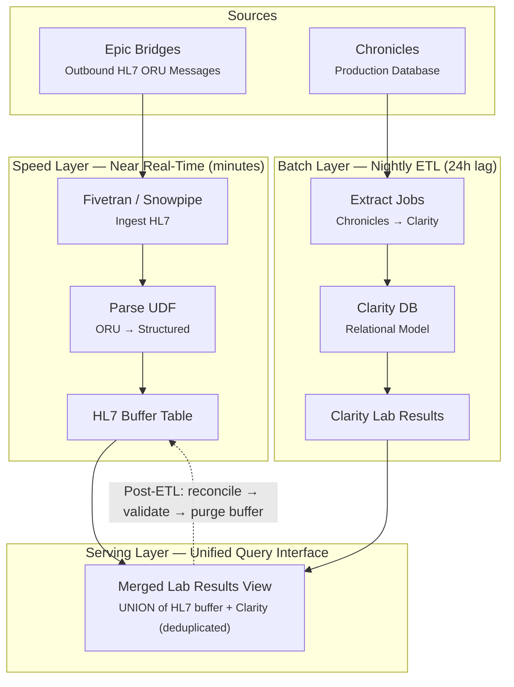

## Problem Statement
The current Chronicles-to-Clarity ETL is a nightly batch process, resulting in a 24-hour data lag for lab results. For communicable disease surveillance, near real-time access to lab results is required to detect and respond to reportable conditions quickly. Running the Clarity ETL on an hourly basis introduces performance risk to the production Chronicles database and is architecturally complex for marginal latency improvement.

## Proposed Solution: Lambda Architecture for Lab Surveillance
Rather than increasing the frequency of the Clarity ETL, this design intercepts outbound HL7 ORU lab result messages from Epic Bridges and processes them through a parallel real-time pipeline into Snowflake. The nightly Clarity ETL continues unchanged as the authoritative batch layer. A unified serving layer merges both sources so consumers query a single view.

This follows the **Lambda Architecture** pattern — a data processing model that combines batch and real-time stream processing to deliver both completeness and low latency.

## Architecture Diagram

## Layer Descriptions

### Speed Layer (HL7 Message Intercept)
The speed layer taps into the outbound HL7 ORU message stream from Epic Bridges. These messages are already being generated for downstream systems (e.g., PPHS lab reporting). An ETL tool such as Fivetran or Snowpipe lands the raw HL7 messages into Snowflake, where a UDF (Java or Python) parses the ORU segments into structured columns matching the Clarity lab results schema.

The output is an **HL7 Buffer Table** containing the last 24-48 hours of lab results in near real-time. This table uses a narrow schema focused on surveillance-relevant fields: accession number, LOINC code, result value, collection datetime, and patient demographics from the PID/PV1 segments.

**Key reference:** Snowflake provides an open-source pattern for HL7 V2 message processing using Java UDTFs and Python UDFs — [Processing HL7 V2 Messages with Snowflake](https://www.snowflake.com/en/developers/guides/processing-hl7-v2-messages-with-snowflake/).

### Batch Layer (Nightly Clarity ETL)
The existing nightly ETL extracts data directly from Chronicles into the Clarity relational database. This is unchanged from current operations. Clarity provides the complete, fully enriched lab results with full clinical context (encounter details, problem lists, medication context, insurance) and handles amendments, corrections, and deduplication natively.

### Serving Layer (Merged View)
A SQL view unions the HL7 Buffer Table with the Clarity Lab Results table. A `NOT EXISTS` clause suppresses HL7 rows that already appear in Clarity (keyed on accession number + LOINC code + collection datetime). Consumers query a single view regardless of data source.

## Reconciliation Process
After the nightly Clarity ETL completes:
1. **Validate** — Run a reconciliation query to identify HL7 buffer records with no corresponding Clarity match. These indicate potential interface gaps or ETL failures.
2. **Investigate** — Any unmatched records should be reviewed before purging.
3. **Purge** — Delete reconciled HL7 buffer records older than 48 hours (the overlap window provides a safety margin for validation).

## Benefits
- **Near real-time lab surveillance** without modifying the production Clarity ETL schedule
- **No performance impact on Chronicles** — the speed layer reads from the Bridges HL7 stream, not from the production database
- **Schema compatibility** — the merged view aligns with Clarity's data model, so existing reports and data assets can consume it without modification
- **Auditability** — raw HL7 messages are preserved in Snowflake and can be reprocessed if parsing logic evolves

## Risks and Mitigations

| Risk | Mitigation |
|------|-----------|
| HL7 parser maintenance — segment optionality, Z-segments, lab-specific quirks | Keep the speed layer schema narrow (surveillance fields only); preserve raw HL7 for reprocessing |
| Duplicate and amendment handling in HL7 stream | Idempotent processing keyed on accession number; Clarity becomes authoritative post-ETL |
| Interface outages creating surveillance gaps | Monitor expected vs. actual message volume; alert on flow gaps |
| Schema drift between HL7 buffer and Clarity across Epic upgrades | Include schema validation in the reconciliation process |
| Additional HIPAA/BAA surface area | Ensure Fivetran BAA is in place (Business Critical plan); include Snowflake pipeline in security audit scope |
| Missing clinical context in HL7 messages (no problem list, medication context, etc.) | Use HL7 stream for initial surveillance signal; join against nightly Clarity/Caboodle for case investigation enrichment |

## Related
- [[Communicable Disease Solution Architecture]]
- Lambda Architecture pattern — originally described by Nathan Marz (creator of Apache Storm), circa 2011
