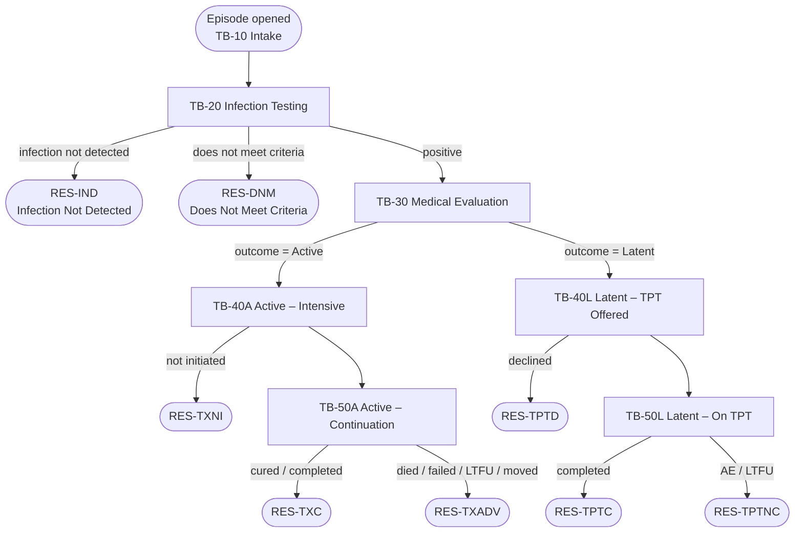

# Build Specification — TB Communicable Disease Episode in Compass Rose

> **System:** Connect Care (Epic) — Compass Rose &nbsp;|&nbsp; **Scope:** One episode type spanning Active TB and Latent TB infection &nbsp;|&nbsp; **Status:** Draft for build-team review
>
> Companion artefacts: the visual logic model [[TB CD Episode - Compass Rose Logic Model]] (decision tree and stage tasks) and the source product reference [[Compass Rose Tasks Setup and Support Guide]] (Epic, Last Updated 21 May 2026). Contact-episode creation is realized by the interface specs [[Interface Specification - Create CD Episode and Draft Contact Abstract (OMRA to Connect Care)]] and [[Interface Specification - Open Contact Identification from CD Abstract (Connect Care to OMRA)]]. Program context: [[CLAUDE-Communicable-Diseases]].

## 1. Purpose and Context

This specification tells a Connect Care builder how to configure a **single Compass Rose episode** that manages both an **Active TB** case and a **Latent TB infection (LTBI)** preventive-treatment course, with the path determined by an episode attribute rather than by separate episode types. It realizes three design requirements set out in the logic model:

1. **One episode for both Active and Latent.** A single episode type; the Active/Latent distinction is carried as the episode's **tracking status** (and the determination task's outcome), not as a second episode type.
2. **Stage- and type-specific tasks and targets.** The tasks and targets that appear are scoped to the current stage and to the Active/Latent attribute.
3. **Only the next stage's work is created (no mass-closing).** Downstream tasks are generated just-in-time as predecessors complete; when a condition is not met, the episode resolves and the small open set is auto-resolved — there is nothing to close by hand.

Every configuration point below cites the relevant item number / record from [[Compass Rose Tasks Setup and Support Guide]] so the build is traceable. Values shown are **drafted for review** — confirm or adjust the naming, due-date intervals, and outcomes with the TB program and Connect Care teams.

---

## 2. Design Principles (how the three requirements are met)

| Requirement | Mechanism | Guide reference |
|---|---|---|
| One episode, both paths | Single episode type; Active/Latent held as **tracking status branch** + determination **task outcome** | Episode status drives template adds (`I HSB 18010`) |
| Stage/type-specific tasks & targets | **Status-event template adds** + **outcome-based Task Rule branching** + **Target Outcome→Target Set** | `I HBD 76345/76346`; Task Rule `I LTR 53121`; `I LTR 24050/24051` |
| Only next-stage tasks; no mass close | **Just-in-time chaining** on completion; **auto-complete from documentation**; **auto-resolve on episode resolution** | `I LTR 53122/53127`; auto-complete (Nov 2022); auto-resolve `I LTR 26100/26101` + episode-type level |

The key architectural move: **the workflow stage IS the tracking status, and advancing the tracking status is the single lever that builds the correct branch.** Because tasks are chained and status-driven, the full care plan is never instantiated up front, so an unmet condition never leaves a backlog of tasks to close.

---

## 3. Scope

**In scope:** episode type configuration; tracking-status model; checklist tasks and targets for intake/determination, the Active path, and the Latent path; the automation that adds, branches, completes, and resolves them; security/licensing prerequisites; build sequence.

**Out of scope (referenced, built per companion guides):** the Episode Type record's full clinical configuration (statuses framework, case teams) — see *Create an Episode Type for Care Management*; the *Automatically Resolve Care Plans, Tasks, and Targets* detail; Decisions setup (optional); Care Plans/Goals (optional); and contact-episode spawning, which is realized by the OMRA↔Connect Care interface specs above.

---

## 4. Episode Type Configuration

Configure one Compass Rose episode type in the **Episode Type Editor**.

| Setting | Draft value | Item / notes |
|---|---|---|
| Episode display name | **TB Communicable Disease Episode** | — |
| Episode class | **33‑Compass Rose Program** *(confirm vs. a custom CD class used by the CD Abstract)* | `I LTR 53100` must match on every task/target |
| Default Creation Status | **TB‑10 Intake – Under Investigation** | `I HBD 76325` |
| Responsible entity | **Compass Rose Case Team**, Responsible role = **Public Health TB Nurse** | task `I LTR 53102` = Compass Rose Case Team; `I LTR 53104` = role |
| Default Target Set | **TPL‑CORE‑TARGETS** (§8) | `I HBD 24004` (Care Management tab) |
| Auto-resolve tasks/targets on resolution | **Enabled** — delete incomplete checklist tasks; targets per-record (§11.5) | episode-type level, *Automatically Resolve Care Plans, Tasks, and Targets* |

> **The Active/Latent attribute.** Materialize it two ways that reinforce each other: (a) the **Medical Evaluation** determination task records an outcome of `Active TB` or `Latent TBI`, and (b) that outcome advances the episode to the corresponding **tracking-status branch** (TB‑40A vs TB‑40L), which fires the branch's template adds. If a clean, reportable classification field is also wanted, add an episode **SmartData** element `TB Classification` — note SmartData is outside the scope of [[Compass Rose Tasks Setup and Support Guide]] and would be specified separately.

---

## 5. Tracking-Status Model (the stages)

In-flight statuses (overall status `I HSB 18010` = Active):

| Code | Tracking status | Stage / meaning |
|---|---|---|
| TB‑10 | Intake – Under Investigation | Contact identified; episode opened; attribute undetermined |
| TB‑20 | Infection Testing | TST/IGRA ordered and resulted |
| TB‑30 | Medical Evaluation | CXR + clinical evaluation; **determination decision** |
| TB‑40A | Active TB – Treatment (Intensive) | Attribute = Active; intensive phase |
| TB‑50A | Active TB – Treatment (Continuation) | Continuation phase |
| TB‑40L | Latent TBI – TPT Offered | Attribute = Latent; offer/accept |
| TB‑50L | Latent TBI – On TPT | TPT in progress + monitoring |

Resolution statuses (overall status = Resolved; the close-reason taxonomy from the logic model):

| Code | Resolution reason | Class |
|---|---|---|
| RES‑DNM | Closed – Does Not Meet Criteria | Appropriate exit |
| RES‑IND | Closed – Infection Not Detected | Appropriate exit |
| RES‑TPTC | Closed – TPT Completed | Success |
| RES‑TXC | Closed – Treatment Completed / Cured | Success |
| RES‑TPTD | Closed – TPT Declined | True attrition |
| RES‑TPTNC | Closed – TPT Not Completed (AE / LTFU) | True attrition |
| RES‑TXNI | Closed – Treatment Not Initiated | True attrition |
| RES‑TXADV | Closed – Adverse Outcome (Died / Failed / LTFU / Moved) | True attrition |

> Keeping appropriate-exit, success, and attrition as **distinct resolution reasons** is what lets the cascade funnel be read straight from episode status — only the *True attrition* reasons count as cascade loss.

---

## 6. Episode Status Progression

---

## 7. Targets (program milestones)

Targets are program-level, time-bound milestones (created in the **Task Editor** with `Is Compass Rose Target? I LTR 26000 = Yes`). Build **in reverse series order**. Where a target's due date is keyed to a prior target's completion, set Due Date method `I LTR 53101 = Days from completion of Target` and the prior target in **Initiating Targets** `I LTR 24030`.

| Code | Target | Due date | Key fields |
|---|---|---|---|
| T1 | Make contact with client / source case | 2 days from creation | model on Foundation 7650000005 |
| T2 | Complete exposure & risk assessment | 5 days from creation | — |
| T3 | Complete TB infection test (TST/IGRA) | 14 days from creation | Completion Encounter Outcomes `I LTR 24005`: Positive / Negative |
| T4 | Complete medical evaluation (CXR) | 7 days from T3 completion | Initiating Targets = T3; **Outcome→Target Set** (`24050/24051`): `Active`→T5A, `Latent`→T5L |
| T5A | Initiate TB treatment | 7 days from T4 completion | Active branch |
| T6A | Complete TB treatment / cure | per regimen (e.g. 6 months) | Base type `I LTR 24000 = Completion` (completes episode); outcome Cured/Completed |
| T5L | Offer TPT | 14 days from T4 completion | Latent branch |
| T6L | Complete TPT | per regimen (3HP ≈ 12 wks; 4R ≈ 4 mo; 9H ≈ 9 mo) | Base type = Completion; outcome TPT Completed |

Group these into target templates: **TPL‑CORE‑TARGETS** (T1–T4, default target set), **TPL‑ACTIVE‑TARGETS** (T5A, T6A), **TPL‑LATENT‑TARGETS** (T5L, T6L).

---

## 8. Checklist Task Inventory

All tasks: Task Context `I LTR 29 = Checklist`; Episode Class `I LTR 53100` = the episode class from §4; Responsible entity per §4 unless noted. "Next" = **Task To Add** `I LTR 53122` (single task) or **Task Template to Add** `I LTR 53127` (template). "Auto-complete" = auto-complete-from-documentation record (§11.4).

### 8.1 Stage A — Intake & Determination (template TPL‑INTAKE; added on episode creation)

| Code | Task | Next on completion | Auto-complete from | Outcomes / branching |
|---|---|---|---|---|
| A1 | Open episode & link **Source Care Abstract ID** | → A2 | — | cross-ref interface specs |
| A2 | Record exposure & risk factors | → A3 | — | — |
| A3 | Order & administer TST/IGRA; obtain result | → A4 | IGRA/TST result final | Positive → A4; Negative → resolve RES‑IND |
| A4 | Chest x-ray & clinical evaluation (**determination**) | Task Rule branches | CXR result final | **Task Rule `I LTR 53121`**: outcome `Active` → advance TB‑40A; `Latent` → advance TB‑40L |

### 8.2 Stage B — Latent TBI / TPT (template TPL‑LATENT; added on status → TB‑40L)

| Code | Task | Next on completion | Auto-complete from | Outcomes / branching |
|---|---|---|---|---|
| L1 | Assess TPT eligibility & baseline LFTs | → L2 | LFT result final | — |
| L2 | Counsel & offer TPT; select regimen (3HP/4R/9H) | Accepted → L3 | — | Declined → resolve RES‑TPTD |
| L3 | Initiate TPT | → L4 | — | advance TB‑50L |
| L4 | Monthly adherence & hepatotoxicity monitoring | re-adds **L4** (recurring) | visit/LFT/flowsheet | Months from parent task due date `I LTR 53101 = 31`, value 1 |
| L5 | Confirm TPT completion | completes episode | — | resolve RES‑TPTC (T6L base type Completion) |

### 8.3 Stage C — Active TB / Case Management (template TPL‑ACTIVE; added on status → TB‑40A)

| Code | Task | Next on completion | Auto-complete from | Notes |
|---|---|---|---|---|
| C1 | Confirm dx — smear/culture, NAAT, DST; imaging; case classification | → C2 | culture/NAAT/DST final | — |
| C2 | **Notify public health (Public Health Act)** | → C3 | — | mandatory notifiable-disease step |
| C3 | Spawn **Contact Episodes** — link via Abstract ID | → C4 | — | realized by [[Interface Specification - Create CD Episode and Draft Contact Abstract (OMRA to Connect Care)]] |
| C4 | Initiate treatment — intensive phase (RIPE) under DOT | → C5 | — | baseline labs & vision (ethambutol) |
| C5 | DOT dose administration & monitoring | re-adds **C5** (recurring) | MAR / flowsheet | — |
| C6 | Intensive-phase review & tolerance | Tolerated → C7 | — | Issues → C‑AE (manage AEs / DST-guided change), then back to C6 |
| C7 | Continuation phase under DOT; monthly cultures | re-adds **C7** (recurring) | culture result final | advance TB‑50A |
| C8 | Treatment outcome determination | completes episode | — | resolve RES‑TXC or attrition reason |

---

## 9. Task & Target Templates Summary

| Template | Type | Contents | Added by |
|---|---|---|---|
| TPL‑INTAKE | Checklist | A1–A4 | On Episode Creation |
| TPL‑CORE‑TARGETS | Target | T1–T4 | Default Target Set (`I HBD 24004`) |
| TPL‑LATENT | Checklist | L1–L5 | Status event → TB‑40L |
| TPL‑LATENT‑TARGETS | Target | T5L, T6L | Status event → TB‑40L |
| TPL‑ACTIVE | Checklist | C1–C8 (+ C‑AE) | Status event → TB‑40A |
| TPL‑ACTIVE‑TARGETS | Target | T5A, T6A | Status event → TB‑40A |

Templates are built in the **Task Template Editor** (`Template context I LTT 29 = Checklist`; `Episode class I LTT 53100` per §4; `Task Records I LTT 800` = member tasks).

---

## 10. Automation Build

### 10.1 Status-event template adds
In the **Compass Rose Episode Defaults** table (Episode Type), add rows mapping Event `I HBD 76345` → Default Template `I HBD 76346`:

- On Episode Creation → **TPL‑INTAKE** (core targets added via Default Target Set).
- Custom event **→ TB‑40A (Active)** → **TPL‑ACTIVE** + **TPL‑ACTIVE‑TARGETS**.
- Custom event **→ TB‑40L (Latent)** → **TPL‑LATENT** + **TPL‑LATENT‑TARGETS**.

Define the custom events via category list `HBD / 76345‑Episode Defaults Status Events`, then the **Compass Rose Episode Status Update Automation** screen: leave Prior Tracking Status `I LSD 79351` blank, set Subsequent Tracking Status `I LSD 79353` = TB‑40A (and a second event for TB‑40L). The **Build Wizard** feature **72043** can create these events and automation rows.

### 10.2 Determination branching
On task **A4**, configure Task Rule `I LTR 53121` (Episode context Task context rule) so the recorded outcome advances the episode to TB‑40A or TB‑40L; the §10.1 status events then add the correct branch. In parallel, target **T4**'s Outcome→Target Set (`24050/24051`) generates T5A or T5L. (Confirm whether the status advance is rule-automated or a nurse action — see §13.)

### 10.3 Task-completion chaining
Set Task To Add `I LTR 53122` / Task Template to Add `I LTR 53127` per §8 so each task spawns only its successor. Recurring monitoring (L4, C5, C7) re-adds itself with relative due dates (`Days/Months from parent task due date`).

### 10.4 Auto-complete from documentation
Create auto-completion records (auto-link option) for: A3 (TST/IGRA result), A4 (CXR result), C1 (culture/NAAT/DST), L1 (LFT), and the recurring monitoring tasks (flowsheet/visit/lab). Task shows *Started* on documentation creation and *Completed* when the documentation is final.

### 10.5 Auto-resolve on episode resolution (the "no mass close")
At the episode-type level, on Resolved (closed or declined) **delete incomplete checklist tasks**. For targets, set per-record Auto-Resolve: Linked Episode Tracking Status `I LTR 26100` = all in-flight statuses; Target Auto-Resolve Action `I LTR 26101` = **Delete** (incomplete) or **Complete** with the appropriate Target Outcome where a milestone was genuinely met; use **No Action** for any target requiring manual verification. Result: choosing a resolution reason (e.g., RES‑DNM) clears the handful of open items automatically.

### 10.6 (Optional) Decisions-linked tasks
If a formal decision gates a branch (e.g., TPT regimen approval), enable **Decision-Linked Tasks** (license below) and let users add the branch's tasks from the Decisions navigator, or trigger them via an OurPractice Advisory on decision creation.

---

## 11. Build Sequence

1. Confirm licences and security (§12).
2. Create **Targets** in reverse series order; then **target templates**.
3. Create **Checklist tasks** in reverse chain order; set Task To Add / Task Template to Add, Task Rule, due dates, responsible entity, allowed outcomes; then **task templates**.
4. Create the **episode type**: class, default creation status, default target set, case team/responsible entity, tracking statuses, auto-resolve settings.
5. Define **custom status events** (category 76345) and **Episode Defaults** rows (or Build Wizard 72043).
6. Configure **auto-complete-from-documentation** records.
7. Build the **Checklist** and **Targets navigators** and Reporting Workbench work lists (template 17840‑Find Episode Tasks; detail report 94009‑Compass Rose Case Summary).
8. **Test** each branch, each recurring task, and each resolution reason (verify auto-resolve clears the open set).

---

## 12. Security & Licensing Prerequisites

| Item | Value |
|---|---|
| User security points | 223‑Episode Checklist View; 224‑Episode Checklist Edit |
| Admin security points | 385‑Edit Task & Task Templates; 22050‑Episodes – Episode Administrator |
| Automation licence | **HP Task Engine** (Event Engine; in Compass Rose licence) |
| Add/remove via advisory | **HP Task Checklist** (in standard Healthy Planet licence) |
| Reporting Workbench checklist | **COCM_EPISODE_CHECKLIST_WEB** (in standard Compass Rose licence) |
| Decisions-linked tasks (optional) | **Decision-Linked Tasks** (in standard Compass Rose licence) |
| Checklist menu descriptor | 35033‑ESC_ITM_SOCIAL_EPISODE_CHECKLIST (Program/Service class) |
| Targets navigator section | 65003‑SEC_ESC_Targets |
| Checklist navigator config | 96003‑ESC Unified Checklist Navigator Configuration |

Licence parent SLG: **3550868**.

---

## 13. Open Decisions for the Build Team

1. **Episode class** — confirm 33‑Compass Rose Program vs. a custom CD class consistent with the Communicable Disease Abstract referenced in the interface specs.
2. **Determination advance** — does the A4 outcome **auto-advance** the tracking status (rule-driven) or require the TB nurse to set it? This decides whether §10.2 is a Task Rule or a manual step.
3. **Reportable classification** — do you want a discrete SmartData `TB Classification` attribute for analytics in addition to the tracking-status branch? (Specified separately; outside the tasks guide.)
4. **Contact-episode spawning (C3)** — reconcile with the OMRA interface specs: are contact episodes created from Connect Care or from OMRA, and how is the **Source Care Abstract ID** stamped on each contact's abstract?
5. **Companion guides needed** to fully specify referenced steps: *Create an Episode Type for Care Management*; *Automatically Resolve Care Plans, Tasks, and Targets*; *Decisions* (if used).

---

## 14. Sources & Cross-References

- Product reference: [[Compass Rose Tasks Setup and Support Guide]] (Epic; Last Updated 21 May 2026) — Target Setup, Checklist Task Setup, Optional Task-Related Features.
- Visual logic model: [[TB CD Episode - Compass Rose Logic Model]].
- Interface specs: [[Interface Specification - Create CD Episode and Draft Contact Abstract (OMRA to Connect Care)]]; [[Interface Specification - Open Contact Identification from CD Abstract (Connect Care to OMRA)]].
- Program context: [[CLAUDE-Communicable-Diseases]]; [[CLAUDE-OMRA]].
- Clinical content (regimens, RIPE, DST, notification): Canadian Tuberculosis Standards, 8th ed. — verify thresholds (e.g. 8-week window-period retest) against Alberta TB protocols.

---

_Draft for build-team review. Item numbers reference [[Compass Rose Tasks Setup and Support Guide]]; values are proposed and require TB program / Connect Care confirmation._
