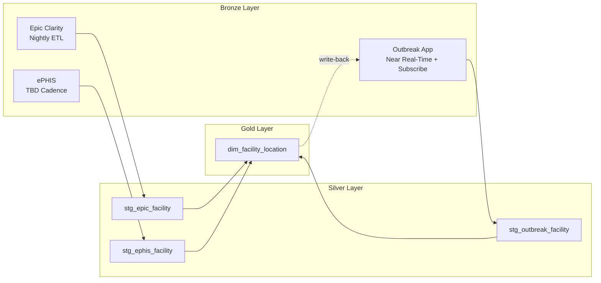
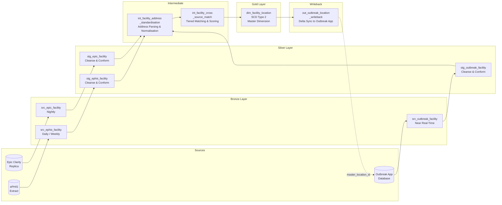

---
tags:
  - communicable-disease
  - data-lake-house
  - architecture
  - specification
scope: Health Shared Services/Primary Care Alberta/Public Health/Communicable Diseases
parent: "[[Communicable Disease Conceptual Data Model]]"
status: draft
last-updated: 2026-05-20
---

# Facility Location Dimension — Data Pipeline Specification

## Purpose

This specification defines the data pipeline design for building and maintaining the **Communicable Disease Location Dimension** within the Communicable Disease Data Lake House. The location dimension aggregates facility and department information from three source systems — **Connect Care (Epic Clarity)**, the **electronic Public Health Inspection System (ePHIS)**, and the **Outbreak Application** — into a single curated master dimension in Snowflake.

As defined in the [[Communicable Disease Conceptual Data Model]], the location dimension provides the spatial context for epidemiological investigation, enabling identification of common exposure sites, determination of where disease was acquired, and targeting of control measures. The dimension supports geographic analysis, cluster detection, and jurisdictional reporting.

This document is intended for the data engineering team working with Coalesce (ETL pipeline tooling) and Atlan (data governance and cataloguing), and for the application teams responsible for the source system views.

---

## Architectural Context

The Communicable Disease Data Lake House follows a medallion architecture pattern within Snowflake:

- **Bronze Layer** — Raw extract-and-load replicas of source system tables. Schema mirrors the source with minimal transformation. Each source system has its own schema within the Bronze database.
- **Silver Layer** — Cleansed, conformed, and standardised source system views. One schema per source system. This is where source-specific data quality rules are applied and where the Source System Glossary in Atlan is documented.
- **Gold Layer** — The curated master dimensions and future fact tables. The master location dimension lives here. Cross-source matching, deduplication, and enrichment occur at this layer.

The ETL orchestration uses **Coalesce** pipeline nodes. Each node is documented as a data asset in **Atlan** with full lineage from source through to the gold layer output ports.



---

## Source System 1 — Connect Care (Epic Clarity)

### Overview

Epic Clarity is the relational reporting database that receives a nightly ETL from the Epic Chronicles operational database. Clarity is already replicated into the Snowflake Data Lake as part of the existing Health Shared Services analytics infrastructure. The facility and department data resides across several core Clarity tables.

### Key Clarity Tables

The following tables form the source view for facility and department information. Column names follow Epic's standard Clarity naming conventions. The data engineering team should validate these against the Connect Care Clarity Data Dictionary on the Epic UserWeb, as local build may include custom columns (prefixed with `ZC_` for category lists or `X_` for extensions).

#### CLARITY_LOC (Revenue Locations)

This table contains location records designated as facility, service area, or location types (EAF Type of Location values 1, 2, or 4). It is the primary table for physical facility identification.

| Column | Type | Description |
|---|---|---|
| LOC_ID | INTEGER | Primary key. Internal Epic location identifier. |
| LOC_NAME | VARCHAR | Name of the revenue location (e.g., "Foothills Medical Centre"). |
| ADDR_LINE_1 | VARCHAR | Street address line 1. |
| ADDR_LINE_2 | VARCHAR | Street address line 2. |
| CITY | VARCHAR | Municipality. |
| STATE_C / ZC_STATE | VARCHAR | Province code (Alberta context). |
| ZIP | VARCHAR | Postal code. |
| COUNTRY_C | VARCHAR | Country code. |
| LOC_TYPE_C | INTEGER | Category: facility (1), service area (2), or location (4). |
| HOSP_ADDR_LINE_1 | VARCHAR | Hospital-specific address (may differ from revenue location address). |
| RPT_GRP_TWO_C | INTEGER | Reporting group — may be used for zone or region alignment. |
| RECORD_STATUS_C | INTEGER | Active/inactive/deleted status. |

#### CLARITY_DEP (Departments)

Departments are organisational units within a facility. In the communicable disease context, department is critical for identifying where within a facility an outbreak is occurring (e.g., a specific inpatient unit, an emergency department, or a public health clinic).

| Column | Type | Description |
|---|---|---|
| DEPARTMENT_ID | INTEGER | Primary key. Internal Epic department identifier. |
| DEPARTMENT_NAME | VARCHAR | Display name of the department. |
| REV_LOC_ID | INTEGER | Foreign key to CLARITY_LOC.LOC_ID — the parent facility. |
| DEPT_ABBREVIATION | VARCHAR | Short code for the department. |
| SPECIALTY_C | INTEGER | FK to ZC_DEP_SPECIALTY — clinical specialty category. |
| CENTER_C | INTEGER | Grouping of like departments (may cross physical locations). |
| SERV_AREA_ID | INTEGER | Service area identifier — geographic grouping. |
| ADT_UNIT_YN | VARCHAR | Whether this is an ADT (bed-tracking) unit (Y/N). |
| GL_PREFIX | VARCHAR | General ledger prefix — useful for financial cross-referencing. |
| RECORD_STATUS_C | INTEGER | Active/inactive/deleted status. |

#### ZC_DEP_SPECIALTY (Department Specialty Category List)

| Column | Type | Description |
|---|---|---|
| DEP_SPECIALTY_C | INTEGER | Primary key. Category value. |
| NAME | VARCHAR | Specialty name (e.g., "Infectious Disease", "Emergency Medicine", "Public Health"). |
| TITLE | VARCHAR | Display title. |

#### CLARITY_SA (Service Areas)

Service areas provide a geographic or administrative grouping of locations, which in the Alberta context may align with health zones.

| Column | Type | Description |
|---|---|---|
| SERV_AREA_ID | INTEGER | Primary key. |
| SERV_AREA_NAME | VARCHAR | Name of the service area. |
| RECORD_STATUS_C | INTEGER | Active/inactive status. |

### Epic Source View Definition

A Clarity reporting view should be created (or an existing Caboodle view leveraged) that joins these tables into a single denormalised facility-department view for extraction. The recommended view:

```sql
-- Source View: v_cd_facility_department
-- Purpose: Denormalised Epic facility and department view for
--          Communicable Disease Data Lake House Bronze layer
-- Owner: Connect Care Analytics / Data Engineering

CREATE OR REPLACE VIEW v_cd_facility_department AS
SELECT
    loc.LOC_ID                    AS epic_location_id,
    loc.LOC_NAME                  AS facility_name,
    loc.LOC_TYPE_C                AS location_type_code,
    loc.ADDR_LINE_1               AS facility_address_line_1,
    loc.ADDR_LINE_2               AS facility_address_line_2,
    loc.CITY                      AS facility_city,
    loc.ZIP                       AS facility_postal_code,
    loc.RECORD_STATUS_C           AS facility_status_code,
    sa.SERV_AREA_ID               AS service_area_id,
    sa.SERV_AREA_NAME             AS service_area_name,
    dep.DEPARTMENT_ID             AS epic_department_id,
    dep.DEPARTMENT_NAME           AS department_name,
    dep.DEPT_ABBREVIATION         AS department_abbreviation,
    dep.ADT_UNIT_YN               AS is_adt_unit,
    spec.DEP_SPECIALTY_C          AS specialty_code,
    spec.NAME                     AS specialty_name
FROM CLARITY_LOC loc
LEFT JOIN CLARITY_SA sa
    ON loc.SERV_AREA_ID = sa.SERV_AREA_ID
LEFT JOIN CLARITY_DEP dep
    ON dep.REV_LOC_ID = loc.LOC_ID
LEFT JOIN ZC_DEP_SPECIALTY spec
    ON dep.SPECIALTY_C = spec.DEP_SPECIALTY_C
WHERE loc.RECORD_STATUS_C IS NULL  -- Active records (Epic convention)
   OR loc.RECORD_STATUS_C = 1;     -- Confirm with Connect Care team
```

### ETL Cadence

The existing Clarity-to-Snowflake replication runs **nightly**. The facility/department data is relatively static (changes are infrequent — new departments opening, facility name changes, etc.), so the nightly cadence is sufficient. The Coalesce pipeline node for this source should be configured for **incremental load with full refresh fallback** on a weekly basis.

### Atlan Documentation Requirements

- Register `v_cd_facility_department` as a data asset in the Source System Glossary under "Connect Care (Epic Clarity)".
- Document lineage from the four underlying Clarity tables through to the view.
- Tag with data domain: "Communicable Disease", data product: "Location Dimension".

---

## Source System 2 — ePHIS (Electronic Public Health Inspection System)

### Overview

The electronic Public Health Inspection System (ePHIS) is the application used by the Safe and Healthy Environments (SHE) team to monitor and manage inspections for facilities such as restaurants, day cares, personal services establishments, swimming pools, and healthcare facilities. ePHIS contains a rich set of facility data that is particularly valuable for communicable disease investigations involving enteric outbreaks (food-borne illness at restaurants), childcare facility outbreaks, and environmental exposure events.

The ePHIS facility data is expected to serve as the **seed data** for pre-populating the Outbreak Application's location reference, making it a foundational source for the master dimension.

### Expected Source Attributes

The following attributes represent the conceptual data elements expected from ePHIS. The actual table and column names will need to be confirmed with the SHE application team and mapped during the detailed design phase.

| Attribute | Expected Type | Description |
|---|---|---|
| ephis_facility_id | VARCHAR/INTEGER | Primary key within ePHIS. Unique identifier for the inspected facility. |
| facility_name | VARCHAR | Legal or operating name of the facility. |
| facility_type_code | VARCHAR | Classification of the facility (e.g., restaurant, daycare, personal services, pool, healthcare). |
| facility_type_name | VARCHAR | Display name for the facility type. |
| facility_subtype | VARCHAR | Further classification within type (e.g., for restaurants: full service, fast food, catering). |
| operator_name | VARCHAR | Name of the facility operator or owner. |
| operator_contact_phone | VARCHAR | Operator's contact phone number. |
| operator_contact_email | VARCHAR | Operator's contact email. |
| address_line_1 | VARCHAR | Street address. |
| address_line_2 | VARCHAR | Suite, unit, or additional address detail. |
| municipality | VARCHAR | City or town. |
| postal_code | VARCHAR | Canadian postal code. |
| health_zone | VARCHAR | Alberta Health Services zone (Calgary, Edmonton, Central, South, North). |
| latitude | DECIMAL | Geographic coordinate for mapping and spatial analysis. |
| longitude | DECIMAL | Geographic coordinate for mapping and spatial analysis. |
| licence_status | VARCHAR | Current licensing or permit status (active, suspended, revoked, closed). |
| last_inspection_date | DATE | Date of the most recent inspection. |
| last_inspection_result | VARCHAR | Outcome of the most recent inspection (pass, conditional pass, fail, closure order). |
| capacity | INTEGER | Licensed capacity (e.g., number of childcare spaces, restaurant seating capacity). |
| record_effective_date | DATE | Date the record became effective. |
| record_end_date | DATE | Date the record was deactivated (null if current). |

### Data Extraction Approach

The extraction method for ePHIS needs to be confirmed with the SHE application team. Possible approaches include:

1. **Database replica** — If ePHIS exposes a reporting database, a similar nightly replica into Snowflake Bronze can be established.
2. **API extraction** — If ePHIS provides a REST or SOAP API, a Coalesce pipeline node can call the API on a scheduled basis.
3. **File-based extract** — A scheduled CSV or flat file export from ePHIS, landed in a Snowflake stage for ingestion.

**Open item**: Confirm extraction method, cadence, and data volume with the SHE / ePHIS application team.

### ETL Cadence

ePHIS facility data changes infrequently (new facilities opening, closures, licence status changes). A **daily or weekly** extract is likely sufficient. The cadence should align with the inspection cycle — if inspections can change facility status daily, a daily extract is preferred.

### Atlan Documentation Requirements

- Register the ePHIS source tables/files as data assets in the Source System Glossary under "ePHIS".
- Document the mapping from ePHIS source attributes to the Silver layer staging table.
- Tag with data domain: "Communicable Disease", data product: "Location Dimension".

---

## Source System 3 — Outbreak Application

### Overview

The Outbreak Application is the new custom application being developed to replace the legacy CD/OM system for outbreak management. Unlike Epic and ePHIS, the Outbreak Application has a **dual role** in the location dimension pipeline — it is both a **publisher** (source of new location records created during outbreak investigations) and a **subscriber** (consumer of the curated master dimension to pre-populate its own location reference data).

This publish/subscribe pattern is central to the data architecture. As described in the [[Communicable Disease Solution Architecture]], the Outbreak Application is designated as a **trusted application** — it can add new locations to its own reference after performing a check against the authoritative dimension in the Data Lake House. New locations added in the Outbreak Application flow back to the gold layer where they are matched, deduplicated, and curated before being made available to all consumers.

### Publish — Outbreak Application as Source

During outbreak investigations, investigators may encounter facilities not yet in the master dimension. This is common because outbreaks can be declared at locations that are not healthcare facilities and may not appear in Epic (e.g., a private residence used as a group gathering, a community event venue, or a newly opened facility not yet inspected by ePHIS). The Outbreak Application must be able to create a new location record in its own database, which then flows into the Data Lake House for curation.

#### Expected Source Attributes (Outbound)

| Attribute | Expected Type | Description |
|---|---|---|
| outbreak_location_id | INTEGER | Primary key within the Outbreak Application. |
| location_name | VARCHAR | Name of the facility or location as entered by the investigator. |
| location_type_code | VARCHAR | Classification (healthcare facility, restaurant, daycare, school, community venue, private residence, flight, other). |
| location_type_name | VARCHAR | Display name for the location type. |
| address_line_1 | VARCHAR | Street address. |
| address_line_2 | VARCHAR | Unit, suite, or additional detail. |
| municipality | VARCHAR | City or town. |
| postal_code | VARCHAR | Canadian postal code. |
| health_zone | VARCHAR | Alberta Health Services zone. |
| latitude | DECIMAL | Geographic coordinate (if captured). |
| longitude | DECIMAL | Geographic coordinate (if captured). |
| operator_name | VARCHAR | Facility operator or contact person name. |
| operator_phone | VARCHAR | Contact phone number. |
| associated_outbreak_ei | VARCHAR | The Exposure Investigation (EI) number that triggered the creation of this location. Provides lineage back to the outbreak context. |
| master_location_id | INTEGER | Foreign key to dim_facility_location. Null when newly created; populated after matching in the gold layer. |
| source_verified_flag | BOOLEAN | Whether this location has been verified against the master dimension. |
| created_datetime | TIMESTAMP | When the record was created. |
| modified_datetime | TIMESTAMP | Last modification timestamp. |

### Subscribe — Outbreak Application as Consumer

The Outbreak Application consumes the curated master dimension to:

1. **Pre-populate location search** — When an investigator begins an outbreak, they search the location reference. The master dimension (seeded initially by ePHIS) provides a comprehensive starting list so investigators do not need to manually re-enter known facilities.
2. **Receive master_location_id** — After a newly created outbreak location is matched and curated in the gold layer, the master_location_id is written back to the Outbreak Application so that the local record is linked to the authoritative dimension.
3. **Receive enrichment data** — Attributes from other sources (e.g., ePHIS inspection status, Epic department structure) can be surfaced to the investigator through the subscribed dimension.

#### Subscription Interface Design

The subscription mechanism should follow one of these patterns (to be confirmed with the Outbreak Application development team):

1. **API pull** — The Outbreak Application queries an API (backed by the gold layer view) on demand when an investigator searches for a location.
2. **Event-driven push** — When the gold layer curates a new or updated master record, a message is published (e.g., via a Snowflake stream + task, or a message queue) that the Outbreak Application consumes.
3. **Batch sync** — A scheduled job pushes the current master dimension (or a delta) to the Outbreak Application's location reference table.

**Recommended approach**: A combination of (1) for real-time search and (3) for keeping the local reference in sync. This gives investigators immediate access to the full master dimension while ensuring the local reference table is reasonably current even when the API is unavailable.

### ETL Cadence

The Outbreak Application publish cadence should be **near real-time or event-driven** for new location records. During an active outbreak, investigators may create new locations that need to flow into the Data Lake House quickly so they can be matched and the master_location_id returned. A polling interval of 15–30 minutes, or an event-based trigger on insert/update, is recommended.

The subscribe cadence depends on the chosen interface pattern. For the batch sync component, a **daily** refresh of the local reference table is likely sufficient.

### Atlan Documentation Requirements

- Register the Outbreak Application location table as a data asset — flag it as both "source" and "consumer" in the lineage.
- Document the bidirectional data flow in the Atlan lineage graph.
- Tag with data domain: "Communicable Disease", data product: "Location Dimension".

---

## Silver Layer — Source System Staging Tables

Each source system is staged into a standardised Silver layer table within Snowflake. The Silver layer applies source-specific cleansing and conformation rules while preserving the source system's foreign keys for traceability.

### stg_epic_facility

```sql
CREATE TABLE silver.stg_epic_facility (
    stg_epic_facility_sk        INTEGER AUTOINCREMENT,  -- Surrogate key
    epic_location_id            INTEGER NOT NULL,        -- CLARITY_LOC.LOC_ID
    epic_department_id          INTEGER,                 -- CLARITY_DEP.DEPARTMENT_ID
    facility_name               VARCHAR(255),
    department_name             VARCHAR(255),
    department_abbreviation     VARCHAR(50),
    specialty_name              VARCHAR(255),
    location_type_code          INTEGER,
    service_area_name           VARCHAR(255),
    address_line_1              VARCHAR(255),
    address_line_2              VARCHAR(255),
    city                        VARCHAR(100),
    postal_code                 VARCHAR(10),
    is_adt_unit                 VARCHAR(1),
    facility_status             VARCHAR(50),             -- Decoded from category list
    source_system               VARCHAR(20) DEFAULT 'EPIC_CLARITY',
    source_extracted_at         TIMESTAMP,
    stg_loaded_at               TIMESTAMP DEFAULT CURRENT_TIMESTAMP(),
    stg_hash                    VARCHAR(64)              -- SHA-256 of business columns for CDC
);
```

### stg_ephis_facility

```sql
CREATE TABLE silver.stg_ephis_facility (
    stg_ephis_facility_sk       INTEGER AUTOINCREMENT,
    ephis_facility_id           VARCHAR(50) NOT NULL,
    facility_name               VARCHAR(255),
    facility_type_code          VARCHAR(50),
    facility_type_name          VARCHAR(255),
    facility_subtype            VARCHAR(255),
    operator_name               VARCHAR(255),
    operator_contact_phone      VARCHAR(20),
    operator_contact_email      VARCHAR(255),
    address_line_1              VARCHAR(255),
    address_line_2              VARCHAR(255),
    municipality                VARCHAR(100),
    postal_code                 VARCHAR(10),
    health_zone                 VARCHAR(50),
    latitude                    DECIMAL(10,7),
    longitude                   DECIMAL(10,7),
    licence_status              VARCHAR(50),
    last_inspection_date        DATE,
    last_inspection_result      VARCHAR(50),
    capacity                    INTEGER,
    record_effective_date       DATE,
    record_end_date             DATE,
    source_system               VARCHAR(20) DEFAULT 'EPHIS',
    source_extracted_at         TIMESTAMP,
    stg_loaded_at               TIMESTAMP DEFAULT CURRENT_TIMESTAMP(),
    stg_hash                    VARCHAR(64)
);
```

### stg_outbreak_facility

```sql
CREATE TABLE silver.stg_outbreak_facility (
    stg_outbreak_facility_sk    INTEGER AUTOINCREMENT,
    outbreak_location_id        INTEGER NOT NULL,
    location_name               VARCHAR(255),
    location_type_code          VARCHAR(50),
    location_type_name          VARCHAR(255),
    address_line_1              VARCHAR(255),
    address_line_2              VARCHAR(255),
    municipality                VARCHAR(100),
    postal_code                 VARCHAR(10),
    health_zone                 VARCHAR(50),
    latitude                    DECIMAL(10,7),
    longitude                   DECIMAL(10,7),
    operator_name               VARCHAR(255),
    operator_phone              VARCHAR(20),
    associated_outbreak_ei      VARCHAR(50),
    master_location_id          INTEGER,                 -- May be null if not yet matched
    source_verified_flag        BOOLEAN,
    created_datetime            TIMESTAMP,
    modified_datetime           TIMESTAMP,
    source_system               VARCHAR(20) DEFAULT 'OUTBREAK_APP',
    source_extracted_at         TIMESTAMP,
    stg_loaded_at               TIMESTAMP DEFAULT CURRENT_TIMESTAMP(),
    stg_hash                    VARCHAR(64)
);
```

### Silver Layer Data Quality Rules

The following data quality rules are applied during the Silver layer transformation in Coalesce. Failures are logged to a data quality exception table and surfaced in Atlan for review.

| Rule ID | Source | Rule | Severity |
|---|---|---|---|
| SQ-LOC-001 | All | facility_name / location_name must not be null or empty | Error |
| SQ-LOC-002 | All | postal_code must match Canadian format (A9A 9A9) when present | Warning |
| SQ-LOC-003 | All | city / municipality must not be null | Warning |
| SQ-LOC-004 | Epic | epic_location_id must be unique per extract | Error |
| SQ-LOC-005 | ePHIS | ephis_facility_id must be unique per extract | Error |
| SQ-LOC-006 | Outbreak | outbreak_location_id must be unique per extract | Error |
| SQ-LOC-007 | All | address_line_1 must not be null for non-virtual locations | Warning |
| SQ-LOC-008 | ePHIS | latitude and longitude must be within Alberta bounding box when present (-120.0 to -110.0 W, 49.0 to 60.0 N) | Warning |
| SQ-LOC-009 | Outbreak | associated_outbreak_ei should be a valid EI number format | Warning |
| SQ-LOC-010 | All | Standardise city names to canonical Alberta municipality list | Transform |

---

## Gold Layer — Master Facility Location Dimension

### dim_facility_location

The master dimension table is the authoritative, curated location reference for all communicable disease reporting, outbreak management, and cross-application analytics. Every record in this table has a single surrogate key (`facility_location_sk`) that serves as the foreign key for all fact tables in the Data Lake House.

```sql
CREATE TABLE gold.dim_facility_location (
    facility_location_sk        INTEGER AUTOINCREMENT,   -- Surrogate key (the master_location_id)
    facility_location_bk        VARCHAR(100),            -- Business key (composite or derived)

    -- Core attributes (curated/conformed)
    facility_name               VARCHAR(255) NOT NULL,
    facility_type               VARCHAR(100),            -- Conformed type taxonomy
    facility_subtype            VARCHAR(100),
    department_name             VARCHAR(255),            -- Null if location-level only
    department_abbreviation     VARCHAR(50),
    specialty_name              VARCHAR(255),

    -- Address (standardised)
    address_line_1              VARCHAR(255),
    address_line_2              VARCHAR(255),
    city                        VARCHAR(100),
    province                    VARCHAR(50) DEFAULT 'Alberta',
    postal_code                 VARCHAR(10),
    country                     VARCHAR(50) DEFAULT 'Canada',
    health_zone                 VARCHAR(50),             -- Calgary, Edmonton, Central, South, North

    -- Geographic coordinates
    latitude                    DECIMAL(10,7),
    longitude                   DECIMAL(10,7),

    -- Operator / contact
    operator_name               VARCHAR(255),
    operator_phone              VARCHAR(20),
    operator_email              VARCHAR(255),

    -- Inspection context (from ePHIS)
    licence_status              VARCHAR(50),
    last_inspection_date        DATE,
    last_inspection_result      VARCHAR(50),
    licensed_capacity           INTEGER,

    -- Source system cross-references (foreign keys back to source)
    epic_location_id            INTEGER,
    epic_department_id          INTEGER,
    ephis_facility_id           VARCHAR(50),
    outbreak_location_id        INTEGER,

    -- Match and curation metadata
    match_confidence_score      DECIMAL(5,2),            -- Confidence of cross-source match (0-100)
    match_method                VARCHAR(50),             -- 'exact_address', 'fuzzy_name', 'manual', 'unmatched'
    curation_status             VARCHAR(20),             -- 'auto_matched', 'pending_review', 'manually_curated'
    curated_by                  VARCHAR(100),            -- User or process that confirmed the match
    curated_at                  TIMESTAMP,

    -- SCD Type 2 versioning
    effective_date              DATE NOT NULL DEFAULT CURRENT_DATE(),
    end_date                    DATE DEFAULT '9999-12-31',
    is_current                  BOOLEAN DEFAULT TRUE,

    -- Audit
    created_at                  TIMESTAMP DEFAULT CURRENT_TIMESTAMP(),
    updated_at                  TIMESTAMP DEFAULT CURRENT_TIMESTAMP()
);
```

### Conformed Facility Type Taxonomy

A key curation activity is mapping the diverse facility type classifications from each source into a single conformed taxonomy. The following is a proposed starting point:

| Conformed Type | Epic Source | ePHIS Source | Outbreak App Source |
|---|---|---|---|
| Acute Care Hospital | LOC_TYPE_C = 1 (Facility) + specialty | — | location_type = 'healthcare facility' |
| Continuing Care Home | LOC_TYPE_C = 1 + continuing care departments | Healthcare facility type | location_type = 'healthcare facility' |
| Community Health Centre | LOC_TYPE_C = 4 (Location) + public health departments | — | location_type = 'healthcare facility' |
| Restaurant / Food Service | — | facility_type = 'restaurant' | location_type = 'restaurant' |
| Childcare Facility | — | facility_type = 'daycare' | location_type = 'daycare' |
| School | — | facility_type (if applicable) | location_type = 'school' |
| Personal Services | — | facility_type = 'personal services' | — |
| Correctional Facility | Specialty-based | — | location_type = 'correctional' |
| Shelter / Supportive Living | Specialty-based | — | location_type = 'community venue' |
| Community Venue | — | — | location_type = 'community venue' |
| Private Residence | — | — | location_type = 'private residence' |
| Flight | — | — | location_type = 'flight' |
| Other | Unmapped | Unmapped | location_type = 'other' |

This taxonomy should be maintained as a reference table (`ref_facility_type`) in the gold layer and registered in Atlan as a controlled vocabulary.

### Cross-Source Matching Strategy

Matching records across three source systems is the most complex and critical part of the pipeline. The matching strategy uses a tiered approach:

**Tier 1 — Exact Match on Address + Name**
Standardise address components (street number, street name, city, postal code) using a consistent parsing algorithm. Where address and facility name both match exactly (after standardisation), assign a high confidence score (95–100).

**Tier 2 — Fuzzy Match on Name + Proximity**
Where addresses partially match or names are similar but not identical (e.g., "Foothills Medical Centre" vs. "Foothills Hospital"), apply fuzzy string matching (Jaro-Winkler or Levenshtein distance) combined with geographic proximity (if coordinates are available). Assign a moderate confidence score (70–94).

**Tier 3 — Manual Curation Queue**
Records that cannot be automatically matched above the confidence threshold are placed in a pending review queue. Data stewards review and manually link (or confirm as distinct locations) through an Atlan-based or custom review workflow.

**Tier 4 — Unmatched / New**
Records from any source that have no plausible match in the other sources are added to the master dimension as new records with only the originating source's foreign key populated. As new data arrives from other sources, the matching process re-evaluates.

### Outbreak Application Write-Back

When a new outbreak location record is matched or curated into the master dimension, the `facility_location_sk` (master_location_id) needs to be communicated back to the Outbreak Application. This closes the loop on the publish/subscribe pattern:

1. The Coalesce pipeline generates a **delta view** of newly assigned master_location_id values for outbreak-sourced records.
2. This delta is either pushed via API or made available as a Snowflake shared view that the Outbreak Application's sync process reads.
3. The Outbreak Application updates its local `master_location_id` column, confirming the linkage.

---

## Coalesce Pipeline Node Design

The following diagram shows the Coalesce pipeline nodes for the facility location dimension. Each node should be registered in Atlan with input/output port documentation.



### Pipeline Node Schedule Summary

| Node | Schedule |
|---|---|
| `src_epic_facility` | Nightly (post-Clarity ETL) |
| `src_ephis_facility` | Daily or weekly (TBD with SHE team) |
| `src_outbreak_facility` | Near real-time (15–30 min) or event-driven |
| `int_facility_address_standardisation` | On upstream completion |
| `int_facility_cross_source_match` | On upstream completion |
| `dim_facility_location` | On upstream completion |
| `out_outbreak_location_writeback` | On dimension update |

---

## Data Governance and Atlan Integration

### Data Product Registration

The Facility Location Dimension should be registered in Atlan as a **Data Product** with the following metadata:

- **Name**: Communicable Disease Facility Location Dimension
- **Domain**: Communicable Disease
- **Owner**: Enterprise Architecture (Alec Blair) / Data Engineering
- **Output Ports**: `gold.dim_facility_location`, Outbreak App write-back view
- **Input Ports**: Epic Clarity view, ePHIS extract, Outbreak App extract
- **SLA**: Updated within 24 hours of source system changes (Epic, ePHIS); within 1 hour for Outbreak App new locations
- **Data Quality Score**: Tracked via the Silver layer DQ rules; target >95% pass rate

### Asset Lineage

Full lineage should be documented from each source system table through Bronze, Silver, and Gold layers. This enables impact analysis when source systems change (e.g., an Epic upgrade that renames columns, or an ePHIS schema change) and supports regulatory compliance for public health data provenance.

### Glossary Terms

The following terms should be added to the Atlan business glossary:

- **Facility** — A physical building or site where health services are delivered, food is prepared and served, childcare is provided, or other regulated activities occur.
- **Department** — An organisational unit within a facility, typically representing a clinical or administrative function.
- **Location Dimension** — The curated, cross-source master reference for all physical places relevant to communicable disease surveillance.
- **Trusted Application** — An application authorised to add new records to its local dimension reference after checking against the authoritative master.
- **Application of Record** — The identified source application for a particular data definition.

---

## Open Items and Decisions Required

| # | Item | Owner | Status |
|---|---|---|---|
| 1 | Confirm Epic Clarity column names and any Connect Care custom extensions against the Clarity Data Dictionary | Connect Care Analytics | Open |
| 2 | Confirm ePHIS data extraction method (database replica, API, or file extract) and source schema | SHE Application Team | Open |
| 3 | Confirm ePHIS data volume and refresh cadence requirements | SHE Application Team | Open |
| 4 | Confirm Outbreak Application database schema for location table | Outbreak App Dev Team | Open |
| 5 | Confirm Outbreak Application subscription interface pattern (API pull, event push, batch sync, or hybrid) | Outbreak App Dev Team / Data Engineering | Open |
| 6 | Define the conformed facility type taxonomy with CDC, SHE, and IPC stakeholders | Architecture / Business | Open |
| 7 | Confirm address standardisation approach (Snowflake UDF, external service, or Coalesce transformation) | Data Engineering | Open |
| 8 | Determine whether geographic coordinates are available from Epic (may require geocoding addresses) | Data Engineering | Open |
| 9 | Confirm Atlan workflow for manual curation queue | Data Governance | Open |
| 10 | Define the SLA for outbreak location write-back latency | Architecture / Outbreak App Dev Team | Open |

---

## Related Documents

- [[Communicable Disease Conceptual Data Model]]
- [[Communicable Disease Solution Architecture]]
- [[Communicable Disease Solution Concept Model]]

---

_Status_: Draft
_Author_: Alec Blair
_Last Updated_: 2026-05-20
_Version_: 0.1
