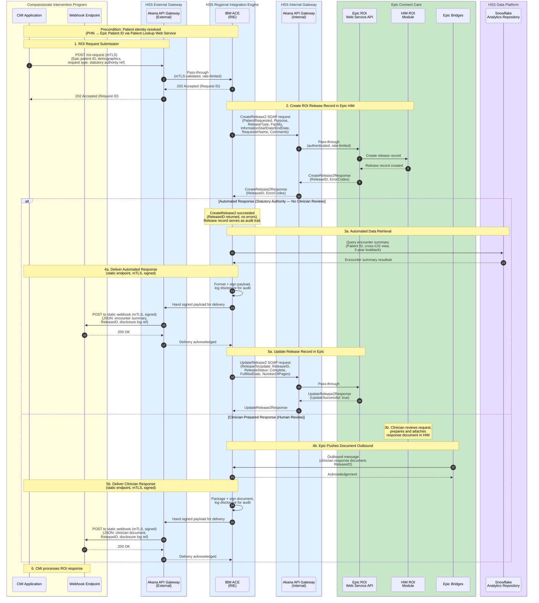

# Compassionate Intervention — Release of Information Sequence Diagram

## Proposed Integration Pattern: Compassionate Intervention Program ↔ HSS ↔ Epic Connect Care HIM ROI

This diagram illustrates the interaction between the MHA Compassionate Intervention Application (hosted on AWS) and HSS, where HSS creates an ROI request in Epic's HIM module via Epic's proprietary ROI Web Service API, and the response follows one of two paths: an automated encounter summary from Snowflake, or a clinician-prepared document returned through the Epic ROI interface.

**Key design decisions:**
- Patient identity is **resolved in advance** of any ROI API call — PHN is mapped to an Epic patient ID (MRN/EPI) via Epic's Patient Lookup Web Service (spec #5454) before calling CreateRelease2
- Two separate **Akana API Gateway** instances: an **external** instance serving as the primary connection point between CIP and HSS, and an **internal** instance mediating calls from the RIE (IBM ACE) to Epic. Both are pass-through gateways with no business logic
- The ROI request is created via **Epic's ROI Web Service API** (open.epic spec #5450) using the `CreateRelease2` SOAP method — a proprietary web service for creating and updating ROI requests
- Epic's ROI Web Service requires a **client ID** for authentication via Epic's authorization framework
- For the **automated path**, a successful `CreateRelease2` response (ReleaseID returned) serves as the trigger to query Snowflake — the Epic release record functions as an audit trail under statutory authority, not an approval gate
- **IBM ACE** (the RIE integration engine) handles Snowflake connectivity directly via the SQL API
- For the **clinician-prepared path**, the clinician reviews the request within Epic HIM, prepares and attaches a response document, and Epic pushes the document outbound through the **Connect Care ROI Interface** via **Epic Bridges**
- HSS can update the release record status in Epic using the `UpdateRelease2` SOAP method (e.g., marking it Complete or adding comments after delivery)
- Calls from CIP to HSS route through the **external Akana** instance; calls from IBM ACE to Epic route through the **internal Akana** instance — both handle authentication, rate limiting, and API governance
- The CIP ↔ HSS boundary uses **mutual TLS (mTLS)** in both directions, terminated at the external Akana gateway. The webhook is delivered to a **static, per-environment endpoint** configured in HSS (no caller-supplied `callbackUrl`), and the payload is **HMAC-signed** at the message level since mTLS authenticates the channel but not the message

## Design Rationale

### Why Epic's ROI Web Service API?
Epic provides a **proprietary SOAP-based web service** specifically for creating and updating ROI requests (open.epic specification #5450, under [Web Services](https://open.epic.com/Interface/WebServices)). The recommended methods are `CreateRelease2` (available since August 2018) and `UpdateRelease2` (available since Epic 2017), which supersede the deprecated `CreateRelease` and `UpdateRelease` methods. The API requires a client ID obtained through Epic's app registration process.

### Two response paths
The design supports two mutually exclusive response paths per request:
- **Automated (3a–5a):** The successful `CreateRelease2` response (ReleaseID returned, no error codes) confirms the patient was found and the release record was created. This serves as the trigger to query Snowflake for the cross-CIS encounter summary. The Epic release record functions as an audit trail under statutory authority — no clinician approval gate is needed. After delivery, HSS updates the release record in Epic via `UpdateRelease2` to mark it Complete.
- **Clinician-prepared (3b–5b):** A clinician reviews the request within Epic HIM, prepares and attaches a response document. Epic Bridges pushes the completed document outbound to HSS via the Connect Care ROI Interface. HSS then delivers it to the CMI application.

### Patient identity resolution
Patient identity must be resolved **before** calling `CreateRelease2`. The CMI application provides PHN and demographics; HSS resolves the PHN to an Epic patient ID (MRN or EPI type) using Epic's Patient Lookup Web Service (spec #5454). The `CreateRelease2` method requires a `PatientRequested` element with an Epic-known ID and Type, and optionally accepts `PatientDemographics` (FirstName, LastName, DateOfBirth, NationalIdentifier, Sex) for validation.

### CreateRelease2 required parameters
The `CreateRelease2` SOAP method requires the following for the CI ROI use case:
- `PatientRequested` (IDType: ID + Type) — **required**, the resolved Epic patient ID
- `Facility` (IDType) — the facility from which the release is requested
- `ReleaseType` (IDType) — must map to a CI-specific release type configured in Epic
- `Purpose` — mapped to the statutory authority (Compassionate Intervention Act)
- `InformationStartDate` / `InformationEndDate` — defines the 3-year lookback window (YYYY-MM-DD format)
- `RequesterName` — the Statutory Director or authorized requestor
- `RequestedFormat` — e.g., "PDF"
- `Comments` — statutory authority reference, case details

### UpdateRelease2 for audit completion
After delivering the automated response, HSS calls `UpdateRelease2` to update the release record in Epic with:
- `ReleaseStatus` set to "Complete" or "Fulfilled"
- `FulfilledDate` set to the delivery date
- `NumberOfPages` reflecting the payload size
- `Comments` with disclosure log reference

This ensures the Epic HIM release record accurately reflects the completed disclosure for HIA audit purposes.

### Why Snowflake for the automated path?
The CI program requires an encounter summary across **multiple clinical information systems**, not just Epic Connect Care. Snowflake already aggregates this cross-CIS data for analytics. Querying Snowflake provides a single, unified view that would otherwise require separate integrations to each source system.

### Async Webhook to CMI
The webhook delivery from HSS to CMI is an internal architectural choice that keeps the CMI application non-blocking. The clinician-prepared path introduces unpredictable delay, and even the automated path involves a Snowflake query, making an async pattern appropriate for both. Epic's ROI Web Service API (#5450) defines no callback or outbound delivery mechanism, so this webhook transport is defined entirely by HSS.

**Static endpoint, not per-request.** The destination is a static, per-environment URL configured in HSS — CMI does not supply a `callbackUrl`. With a single known counterparty and a PHI payload, a fixed destination removes the SSRF/exfiltration surface of POSTing to a caller-supplied address, is straightforward to evidence for HIA audit, and matches the single mTLS trust relationship. (If per-request routing is ever needed, it should be constrained to a path/correlation segment under the fixed, cert-pinned base host — never a free-form host.)

**mTLS + message signing.** The channel uses mTLS terminated at the external Akana gateway (CMI presents a client cert inbound; Akana presents an HSS client cert and pins the CMI server cert outbound). Because mTLS authenticates the channel but not the message, the payload also carries an `X-HSS-Signature` (HMAC-SHA256 over the raw body) and an `X-HSS-Timestamp` for replay bounding. See [[CI RoI IBM Integration Engine Message Specification#Webhook Transport and Security]].

## Key Considerations

1. **Client ID registration** — HSS will need a registered client ID through Epic's app creation process to call the ROI Web Service. See [Creating, Activating, and Licensing an App](https://fhir.epic.com/Documentation?docId=epiconfhirrequestprocess&section=creating). The full API spec (#5450) requires an open.epic login to access.

2. **Release type configuration** — A CI-specific release type must be configured in Epic's release type database. The `CreateRelease2` `ReleaseType` parameter must reference this record by ID and Type. The release type may also restrict which Purpose values, requested formats, and information types are valid (see `RELEASE-TYPE-RESTRICTION-ERROR` fault).

3. **Facility and department mapping** — `CreateRelease2` requires either a `Facility` or `Department` IDType to determine the ROI service area. This must be mapped to the appropriate Connect Care facility for CI requests.

4. **Epic Bridges outbound configuration** — For the clinician-prepared path, Epic Bridges must be configured to send an outbound message to HSS when a clinician completes a release in HIM. This requires coordination with the Connect Care integration team to define the message format, trigger event, and destination endpoint.

5. **Denial / partial approval path** — The diagram shows the success flows. The design should also handle: `CreateRelease2` returning error codes (e.g., `NO-PATIENT-FOUND`, `NO-RELEASE-TYPE-FOUND`), clinician denial within HIM, or requests for additional information from the clinician back to the CMI application.

6. **Audit and disclosure logging** — Every data release must be logged with the statutory authority reference, the ReleaseID, the approved scope, and the actual data disclosed. This supports compliance with the Health Information Act (HIA). The Epic release record provides part of this trail; HSS must maintain its own disclosure log as well.

7. **Timeout handling** — If clinician review exceeds a defined SLA, the CMI application should be notified so the statutory director can escalate. Since the clinician path relies on an outbound push from Epic, HSS should implement a timeout monitor that fires if no response is received within the SLA window.

8. **Error handling for UpdateRelease2** — If the post-delivery `UpdateRelease2` call fails (e.g., `RELEASE-REQUEST-LOCKED`), this should be logged but not block the CMI delivery, since the clinical data has already been sent. A reconciliation process should retry the update.
