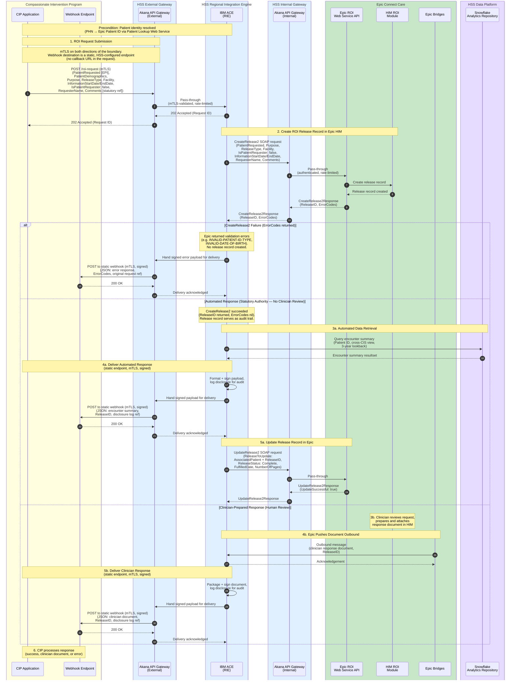

# Compassionate Intervention — Release of Information
## Automated vs. Human Intervention: All Integration Engines

This diagram shows the full end-to-end flow across all integration components, including both the automated (statutory authority, no clinician review) and clinician-prepared (human review, Epic Bridges outbound) response paths, plus error handling.

## Notes

1. **Two Akana gateway instances** — There are two separate Akana API Gateway instances. The **external** instance is the primary connection point between CIP and HSS in **both** directions: it terminates mTLS for the inbound `POST /roi-request` and performs the outbound mTLS delivery of the webhook to CIP's static endpoint. The **internal** instance mediates calls from the RIE (IBM ACE) to Epic's ROI Web Service. Both are pass-through gateways — they handle authentication (mTLS), rate limiting, and API governance but perform no business logic or message transformation.

2. **IBM ACE as the RIE** — The Regional Integration Engine (RIE) runs on IBM App Connect Enterprise (ACE). It handles all business logic: REST-to-SOAP translation for Epic calls, Snowflake SQL API connectivity, payload transformation, disclosure logging, and formatting + **HMAC-signing** the webhook payload. ACE hands the signed payload to the external Akana gateway, which performs the mTLS delivery to CIP.

3. **REST-to-SOAP boundary** — CIP sends a REST `POST /roi-request` which the external Akana instance passes through to IBM ACE. IBM ACE translates the request into a `CreateRelease2` SOAP call (namespace `urn:Epic-com:Access.2018.Services.Patient`), which routes through the internal Akana instance to Epic's ROI Web Service. CIP never calls Epic or IBM ACE directly.

4. **CreateRelease2 required fields** — `PatientRequested` (IDType) is the only field Epic mandates. The CI use case should always populate: `Purpose` (mapped from statutory authority), `ReleaseType`, `Facility`, `IsPatientRequester` (false), `InformationStartDate`/`InformationEndDate` (3-year lookback), `RequesterName`, and `Comments` (statutory authority reference). The "statutory authority ref" from CIP maps to `Purpose` + `Comments` since there is no native Epic field for it.

5. **CreateRelease2 response** — returns either a `ReleaseID` (IDType with ID and Type) on success, or an `ErrorCodes` array on validation failure (e.g. `INVALID-PATIENT-ID-TYPE`, `INVALID-DATE-OF-BIRTH`). Both fields are present in the response envelope.

6. **Error path** — if `CreateRelease2` returns ErrorCodes, no release record is created in Epic. IBM ACE delivers the error details to CIP via the webhook callback so CIP can surface them to the user or retry with corrected data.

7. **Automated path (3a–5a)** — successful `CreateRelease2` (ReleaseID returned, no ErrorCodes) triggers IBM ACE to query Snowflake for the cross-CIS encounter summary and deliver it to CIP. After delivery, IBM ACE calls `UpdateRelease2` (via internal Akana) to mark the release Complete.

8. **UpdateRelease2 payload** — requires a `ReleaseToUpdate` element containing both `AssociatedPatient` (IDType) and `ReleaseID` (IDType). The completion update sets `ReleaseStatus`, `FulfilledDate`, and `NumberOfPages`.

9. **Clinician-prepared path (3b–5b)** — clinician reviews within Epic HIM, prepares and attaches a scoped response document. Epic Bridges pushes the completed document outbound to IBM ACE. IBM ACE delivers it to CIP. This path requires coordination with the Connect Care integration team for Bridges configuration.

10. **202 Accepted semantics** — External Akana returns 202 to CIP (relayed from IBM ACE) before the Epic SOAP call is made. The Epic call can fail after CIP already has a Request ID; failure details are delivered via the webhook callback.

11. **Patient identity** — resolved in advance. PHN mapped to Epic patient ID (EPI) via Patient Lookup Web Service (spec #5454).

12. **Epic ROI Web Service API** — uses `CreateRelease2` and `UpdateRelease2` SOAP methods (spec #5450), the recommended methods superseding the deprecated `CreateRelease` and `UpdateRelease`.

13. **Snowflake connectivity** — IBM ACE connects directly to the Snowflake SQL API using key-pair JWT authentication. This connection does not route through either Akana instance — it is an internal HSS data platform call.

14. **Webhook delivery failure** — if the webhook POST to CIP fails, delivery is retried with exponential backoff and jitter; exhausted deliveries are dead-lettered for operator replay. Because retries can produce duplicates, CIP must treat `requestId` as an idempotency key. The Epic release record remains the system of record regardless of webhook delivery status.

15. **Static webhook endpoint + mTLS** — the webhook destination is a static, per-environment URL configured in HSS, not a `callbackUrl` supplied in the request. This removes the SSRF/exfiltration surface of POSTing PHI to a caller-supplied address and matches the single mTLS trust relationship between HSS and CIP. The channel is mTLS; the payload is additionally HMAC-signed (`X-HSS-Signature`) with a replay-bounding timestamp (`X-HSS-Timestamp`), since mTLS authenticates the channel but not the message. See [[CI RoI IBM Integration Engine Message Specification#Webhook Transport and Security]].
