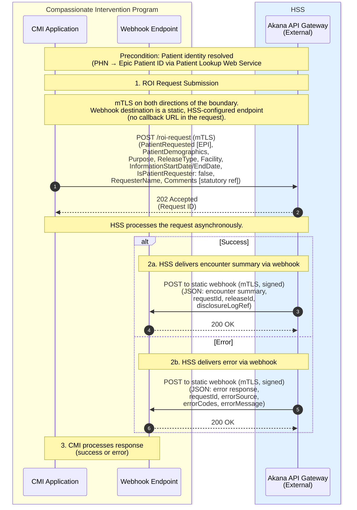

# Compassionate Intervention — Release of Information
## CIP to Akana API Gateway (External Boundary)

This diagram shows the interaction between the CIP application and the HSS external Akana API Gateway from the CIP application's perspective. The Akana API Gateway is the only HSS endpoint CIP communicates with — all internal HSS components (IBM ACE/RIE, Snowflake, Epic) are abstracted behind it.



## CIP Integration Requirements

### Endpoint: Submit ROI Request

```
POST https://<akana-external-host>/roi-request
Content-Type: application/json
# Authentication: mutual TLS — CIP presents a client certificate,
# validated by the external Akana gateway. No bearer token required.
```

**Request body:**

```json
{
  "patientRequested": {
    "id": "<EPIC_PATIENT_ID>",
    "idType": "EPI"
  },
  "patientDemographics": {
    "phn": "<PHN>",
    "familyName": "Smith",
    "firstName": "Jane",
    "birthDate": "1985-03-15",
    "gender": "Female"
  },
  "purpose": "Compassionate Intervention Act - Statutory Authority",
  "releaseType": "CI_ROI",
  "facility": "<REQUESTING_FACILITY>",
  "informationStartDate": "2023-06-03",
  "informationEndDate": "2026-06-03",
  "isPatientRequester": false,
  "requesterName": "Dr. A. Clinician",
  "comments": "Compassionate Intervention Act, SA 2024, c C-16.3, s.11"
}
```

> **No `callbackUrl`.** The webhook destination is a static, per-environment endpoint agreed with HSS during onboarding, not supplied per request.

**Response:** `202 Accepted` with `requestId` in the body. CIP should store this ID to correlate with the webhook callback.

### Endpoint: Webhook Callback (CIP must implement)

CIP must expose a **single, static webhook endpoint per environment** (dev / test / prod) and register its URL with HSS during onboarding. HSS POSTs the result to this configured endpoint — the URL is not carried in individual requests.

CIP's webhook handler must:

- **Accept mTLS** — present the agreed CIP server certificate and validate the HSS client certificate.
- **Verify the signature** — recompute the HMAC-SHA256 in `X-HSS-Signature` over the raw request body using the shared secret, with a constant-time comparison, before parsing the JSON.
- **Check the timestamp** — reject deliveries whose `X-HSS-Timestamp` falls outside a ±5-minute window.
- **Be idempotent** — treat `requestId` (`X-Request-ID`) as an idempotency key so a retried delivery is a no-op.
- **Acknowledge fast** — return `200 OK` (or `202`) on accept, then process asynchronously.

**Success payload:** See [[CI RoI IBM Integration Engine Message Specification#Payload Structure|webhook payload structure]] for the full encounter summary JSON schema.

**Error payload:** See [[CI RoI IBM Integration Engine Message Specification#Error Webhook|error webhook structure]].

### Authentication

The CIP ↔ HSS boundary uses **mutual TLS (mTLS)** in both directions, terminated at the external Akana gateway:

- **Inbound (CIP → HSS):** CIP presents a client certificate that Akana validates.
- **Outbound (HSS → CIP webhook):** Akana presents an HSS client certificate to the static CIP endpoint and pins the CIP server certificate.

In addition, the webhook payload is signed at the message level (HMAC-SHA256, see above), since mTLS authenticates the channel but not the message. Certificate and HMAC-secret rotation schedules are managed by the HSS API governance team; CIP should support overlapping validity during rotation.

### SLA

Target end-to-end: **< 23 seconds** from `POST /roi-request` to webhook delivery.

### Error Handling

CIP should handle the following scenarios:

- **No webhook received** — if no callback arrives within a timeout window (recommended: 60 seconds for automated path), CIP should treat it as a failure and may retry the original request
- **Error webhook** — the `errorSource` field indicates whether the failure was in Epic (`EPIC`) or Snowflake (`SNOWFLAKE`); `errorCodes` provides specifics
- **HTTP errors on POST /roi-request** — standard HTTP error codes apply (401 unauthorized, 429 rate limited, 500 internal server error)

## Related Documents

- [[CI RoI Sequence - CIP to IBM Integration Engine]] — Full automated path sequence including IBM ACE, Akana (Internal), Epic, and Snowflake
- [[CI RoI Proposed Sequence Diagram]] — End-to-end sequence including both automated and clinician-prepared paths
- [[CI RoI IBM Integration Engine Message Specification]] — Detailed message formats and data transformation logic
- [[Compassionate Intervention Release of Information Data Model]] — Entity definitions and attributes
