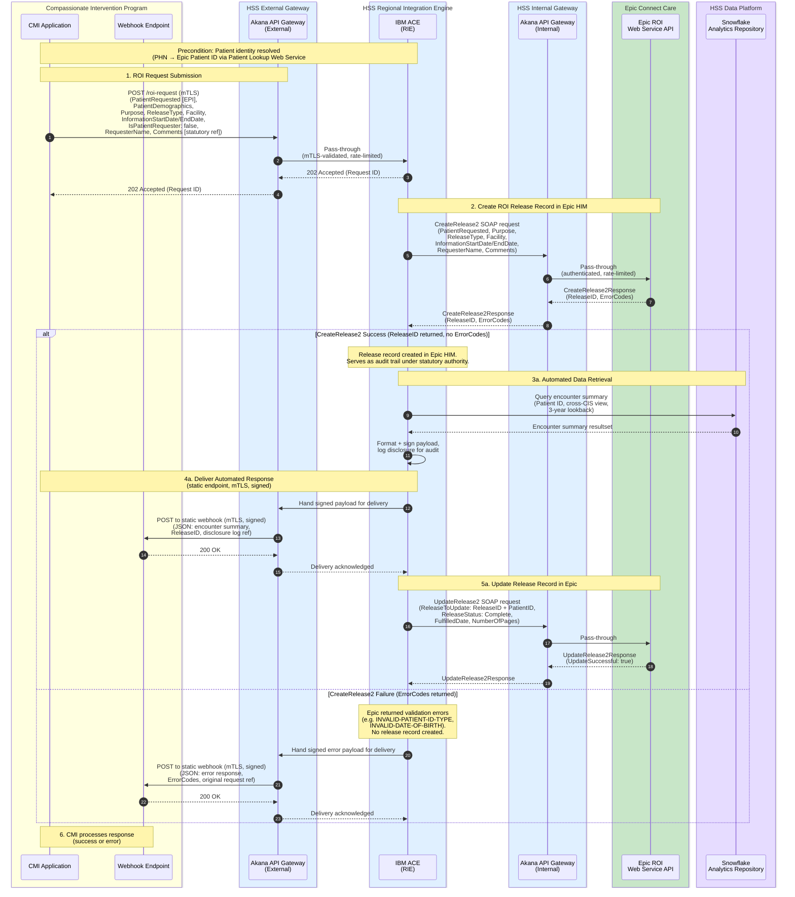

# Compassionate Intervention — Release of Information
## CIP to IBM Integration Engine (Automated Path — Release 1)

This diagram focuses on the interaction between the CMI Application and the HSS Regional Integration Engine (RIE), which runs on IBM App Connect Enterprise (ACE), for the automated (statutory authority) response path. There are two separate Akana API Gateway instances: an **external-facing** instance that serves as the primary connection point between CIP and HSS, and an **internal** instance that mediates calls from the RIE to Epic's ROI Web Service. Both are pass-through gateways (authentication, rate limiting, API governance) with no business logic. The clinician-prepared response path is planned for a future release.

## Notes

1. **Two Akana gateway instances** — There are two separate Akana API Gateway instances in this flow. The **external** instance is the primary connection point between CIP and HSS in **both** directions: it terminates mTLS for the inbound `POST /roi-request` and performs the outbound mTLS delivery of the webhook to CIP's static endpoint. The **internal** instance mediates calls from the RIE (IBM ACE) to Epic's ROI Web Service. Both are pass-through gateways — they handle authentication (mTLS), rate limiting, and API governance but perform no business logic or message transformation.

2. **IBM ACE as the RIE** — The Regional Integration Engine (RIE) runs on IBM App Connect Enterprise (ACE). It handles all business logic: REST-to-SOAP translation for Epic calls, Snowflake SQL API connectivity, payload transformation, disclosure logging, and formatting + **HMAC-signing** the webhook payload. ACE hands the signed payload to the external Akana gateway, which performs the mTLS delivery to CIP.

3. **REST-to-SOAP boundary** — the CMI sends a REST `POST /roi-request` which the external Akana instance passes through to IBM ACE. IBM ACE translates the request into a `CreateRelease2` SOAP call (namespace `urn:Epic-com:Access.2018.Services.Patient`), which routes through the internal Akana instance to Epic's ROI Web Service. The CMI never calls Epic or IBM ACE directly.

4. **CreateRelease2 required fields** — `PatientRequested` (IDType, required) is the only field Epic mandates. However, the CI use case should always populate: `Purpose` (mapped from statutory authority), `ReleaseType`, `Facility`, `IsPatientRequester` (false), `InformationStartDate`/`InformationEndDate` (3-year lookback window), `RequesterName`, and `Comments` (statutory authority reference). The "statutory authority ref" from CMI maps to `Purpose` + `Comments` since there is no native Epic field for it.

5. **CreateRelease2 response** — returns either a `ReleaseID` (IDType with ID and Type) on success, or an `ErrorCodes` array on validation failure. Both are present in the response envelope; success means ReleaseID is populated and ErrorCodes is nil.

6. **UpdateRelease2 payload** — requires a `ReleaseToUpdate` element containing both `AssociatedPatient` (IDType) and `ReleaseID` (IDType). The completion update sets `ReleaseStatus`, `FulfilledDate`, and `NumberOfPages`.

7. **202 Accepted semantics** — Akana returns 202 to CMI (relayed from IBM ACE) before the Epic SOAP call is made. This means the Epic call can fail after CMI already has a Request ID. The error path delivers failure details via the webhook callback.

8. **Snowflake connectivity** — IBM ACE connects directly to the Snowflake SQL API using key-pair JWT authentication. This connection does not route through Akana — it is an internal HSS data platform call.

9. **Patient identity** — resolved in advance. PHN mapped to Epic patient ID (EPI) via Patient Lookup Web Service (spec #5454) before any ROI API call.

10. **Clinician-prepared path** — planned for a future release. Will use Epic Bridges outbound push when a clinician completes a release in HIM. See the All Engines sequence diagram for the planned design.

11. **Webhook delivery failure** — if the webhook POST to CMI fails, delivery is retried with exponential backoff and jitter; exhausted deliveries are dead-lettered for operator replay. Because retries can produce duplicates, CMI must treat `requestId` as an idempotency key. The Epic release record remains the system of record regardless of webhook delivery status.

12. **Static webhook endpoint + mTLS** — the webhook destination is a static, per-environment URL configured in HSS, not a `callbackUrl` supplied in the request. This removes the SSRF/exfiltration surface of POSTing PHI to a caller-supplied address and matches the single mTLS trust relationship between HSS and CIP. The channel is mTLS; the payload is additionally HMAC-signed (`X-HSS-Signature`) with a replay-bounding timestamp (`X-HSS-Timestamp`), since mTLS authenticates the channel but not the message. See [[CI RoI IBM Integration Engine Message Specification#Webhook Transport and Security]].
