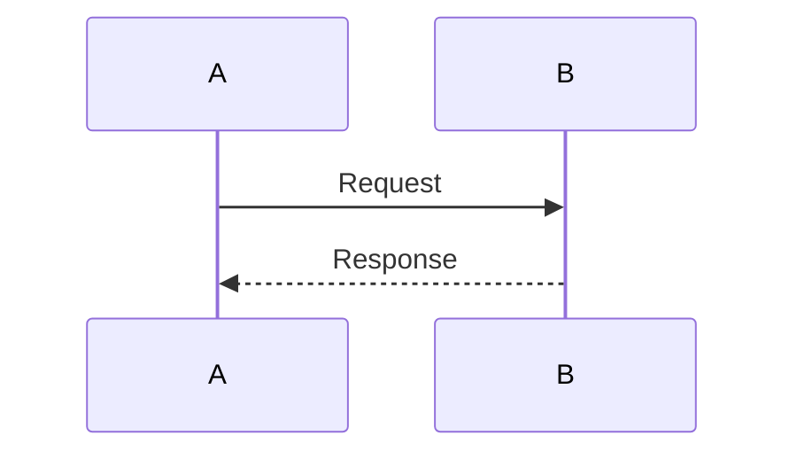

## Tables and Mermaid Test

> This blockquote is jammed directly against the heading above with no blank line, and the paragraph below is jammed against it too.
This paragraph sits with no blank line before the table that follows it.

| Column 1 | Column 2 | Column 3 |
|---|---|---|
| foo | bar | blob |
| baz | qux | trust |

Text immediately after the table with no separating blank line.

### Mermaid Block

Here is a diagram with no blank line before the fence:

And text immediately after the closing fence.

#### A List With Bad Spacing

- Item with too many spaces after the marker
- Another item
1. Ordered item with extra spaces
2. Second ordered item
