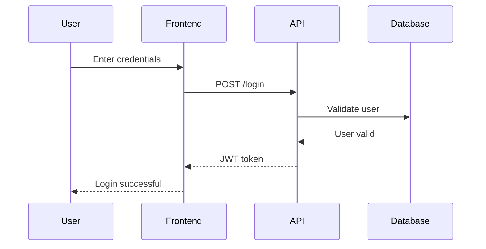

_Welcome to Stealth EA — where we demystify enterprise architecture without losing our minds or our sense of humour. I'm Alec, and I've spent decades creating pictures with rules. This piece was originally published on LinkedIn in January 2023, but I'm republishing it here with a significant update: the rise of modelling-as-code._

---

In my line of work, speaking multiple languages isn't just useful — it's survival. But I'm not talking about French or Mandarin. I'm talking about notation. The secret codes that let us communicate complex ideas without lengthy explanations.

It is said that a picture is worth a thousand words. If that is true, then I would say from my experience that rule-based models are worth ten thousand words. Even if the word count is not a determining factor, a rule-based model communicates with precision in a way that is rapidly understood. Most of us should be literate in a few modelling languages. Not as many need to be proficient in creating models, but I hope maybe after reading this you may want to try.
## The Power of Visual Rules

Let's start with the power of an image generally. For getting around most developed countries, there are good and bad 'infographics' to help us navigate from one place to another. Most of us have seen infographics like Calgary's Light Rapid Transit map that show a rapid transit system. Some are good, some are not. The good ones innately understood rules required for understanding by any citizen.

That can't be said for more complex rule-based modelling languages. The last two-thirds of my life has involved creating pictures with rules which we call models. I realise now that I have been reading models since I was very young. It started with music notation which was developed almost 3,500 years ago. It follows strict rules using a standard set of symbols that, with lots of practice, many can read and translate into music in real time.

![[Happy Birthday.png]]

I think most people in the world could probably figure out the tune of "Happy Birthday" from its musical notation even without a lot of training. Modelling languages can get a lot more esoteric quite quickly.

For almost two decades I was a hockey coach. Many might be surprised that there is a modelling language for notating hockey drills. These are now available for free at [Hockey Canada's Drill Hub](https://www.hockeycanada.ca/en-ca/hockey-programs/drill-hub) and many other websites. Being able to post a drill diagram for my assistant coaches and the players as they got older meant many times we didn't even have to explain the drill. They could look at the model, get the pucks and pylons to the right place on the ice and then get started.

![[Novice Hockey Drill.png]]
## Business Modelling Languages

One of the first business-oriented modelling languages I learned is the Object Management Group's (OMG) Unified Modelling Language. For application developers, UML can be quite effective. For non-developers, not so much. A more common model seen in business is a business process model. The OMG also has a standard for that called Business Process Modelling Notation (BPMN). These languages, if used correctly, can increase the precision of how information is communicated between a business stakeholder, a system analyst and an application developer.

Given my current role as an Enterprise Architect, I now spend most of my time using the ArchiMate modelling language from The Open Group. Here's an example of a Retail Mortgage Value Stream.

![[Retail Mortgage Value Stream.png]]

An effective modelling language and the people who are using it should be able to create models that are easily understood by people who do not know the language. I think most of us have seen music scores and hockey drills that while using the language are unreadable by anyone — even an expert.

## The Rise of Modelling-as-Code

When I first wrote this piece in 2023, I focused on traditional modelling tools — visual editors where you drag shapes and draw connections. But something significant has shifted since then: **modelling-as-code has gone mainstream**.

The premise is simple: instead of clicking around a visual canvas, you write text that describes your model, and the tool renders the diagram for you. Think of it as the difference between using a word processor and writing in Markdown. Both produce documents, but one is far more portable, version-controllable, and — crucially — generatable by AI.

### Mermaid: The Swiss Army Knife

Mermaid has become the de facto standard for diagrams-as-code. If you've used GitHub, Notion, Obsidian, or dozens of other tools, you've probably already encountered it without realising. The syntax is deliberately Markdown-inspired, making it accessible to anyone who can write a README.

Here's some Mermaid 'code' in the original text for a pre-defined model type that is essential in any solution architect's kit bag - a sequence diagram.

	sequenceDiagram
	    participant User
	    participant Frontend
	    participant API
	    participant Database
    
	    User->>Frontend: Enter credentials
	    Frontend->>API: POST /login
	    API->>Database: Validate user
	    Database-->>API: User valid
	    API-->>Frontend: JWT token
	    Frontend-->>User: Login successful


And, here it is rendered as a diagram:



What makes this powerful isn't just the output — it's that this text lives in your Git repository, changes are tracked with meaningful diffs, and anyone can update the diagram without learning a complex tool.

Mermaid supports flowcharts, sequence diagrams, class diagrams, state diagrams, entity-relationship diagrams, and even architecture diagrams (though the latter is still marked as beta). The architecture diagram support now includes over 200,000 icons from Iconify, making it genuinely useful for cloud and infrastructure visualisation.

The real game-changer? AI tools like Claude can generate Mermaid diagrams from natural language descriptions. "Show me the authentication flow for our mobile app" becomes a rendered diagram in seconds.

### DBML: Purpose-Built for Data

While Mermaid is the generalist, DBML (Database Markup Language) is the specialist. Created by the team behind www.dbdiagram.io, DBML is purpose-built for one thing: defining database schemas clearly and rendering them as entity-relationship diagrams.

Here's an example showing a simple content management system:

```dbml
Table users {
  id integer [pk, increment]
  email varchar [unique, not null]
  created_at timestamp [default: `now()`]
}

Table posts {
  id integer [pk, increment]
  title varchar [not null]
  body text [note: 'Content of the post']
  user_id integer [ref: > users.id]
  status post_status
  published_at timestamp
}

Enum post_status {
  draft
  published
  archived [note: 'No longer visible']
}

Table comments {
  id integer [pk, increment]
  post_id integer [ref: > posts.id]
  user_id integer [ref: > users.id]
  content text
  created_at timestamp
}
```

The syntax is readable even if you've never seen DBML before — and that's the point. It's database-agnostic (you're not writing MySQL or PostgreSQL syntax), focused entirely on structure, and renders to clean ER diagrams at dbdiagram.io.  Here's a more complicated example of a rendered diagram using DBML:
![[Stealth Enterprise Architecture/Stealth EA MAD ERD.png]]
For enterprise architects working on data domains, DBML fills a gap that ArchiMate intentionally leaves open. ArchiMate describes data objects at a conceptual level; DBML describes them at the logical and physical level where the actual implementation happens.
## The Investment Question

Does it take a while to learn a rules-based modelling language? For sure, just like anything in life. It takes a whole lot less time to be able to read the language than it does to write in it proficiently.

Is it worth it?

Taking the time to learn at least how to apply a particular model's language is quite valuable. Learning to model in a language is like learning any spoken language. What matters most is how many others speak the same language you're working with. You can learn the rules and develop the models easily enough. It might also make you able to be more efficient in creating models.

For any medium to large-sized organisation, I think it is worth investing in a few modelling languages and where possible a common tool that allows you to share models. For ArchiMate, there is a fabulous open-source tool called Archi that with a few of the plugins can get you started for free. For Mermaid, you already have it — it's built into GitHub, GitLab, Notion, Obsidian, and VS Code. For DBML, dbdiagram.io has a generous free tier.

The modelling-as-code movement has lowered the barrier to entry dramatically. You no longer need expensive licences or specialised training to start creating useful diagrams. You need a text editor and curiosity.

If no one else speaks the language, you're only talking to yourself. But with Mermaid now embedded in half the tools developers already use, that's increasingly not a problem.

---

_What modelling languages have you found most valuable in your work? Hit reply — I read every response. And if you know someone drowning in enterprise architecture diagrams, forward this their way._

_Next time: We'll explore why your EA models need to look marvellous — and what that actually means._